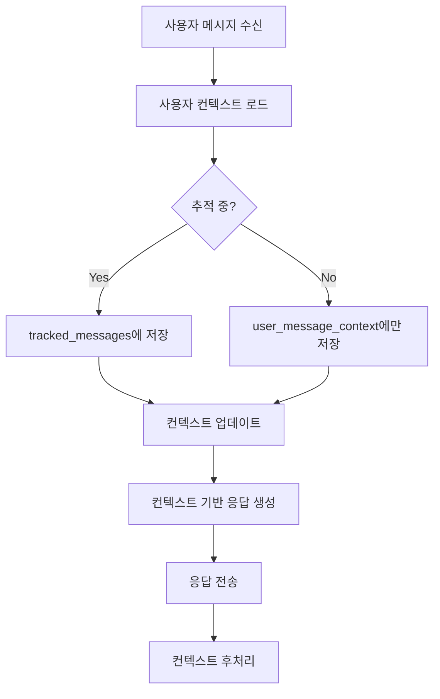

# 통합 사용자 컨텍스트 + 추적 시스템 설계

## 📋 개요

이 문서는 Telegram AI Bot의 사용자별 컨텍스트 관리와 대화 추적 시스템을 통합하는 설계안입니다.

### 🎯 핵심 목표
- 각 사용자별 개별 컨텍스트 관리
- `/track_start` 시 해당 사용자의 추적 세션과 컨텍스트 연동
- 추적된 대화를 컨텍스트 학습에 활용
- 그룹 채팅에서 사용자별 맞춤형 응답 제공

## 🏗️ 아키텍처 설계

### 1. 데이터베이스 스키마 확장

#### 1.1 user_chat_tracking 테이블 확장
```sql
ALTER TABLE user_chat_tracking
ADD COLUMN IF NOT EXISTS conversation_context JSONB DEFAULT '{}',
ADD COLUMN IF NOT EXISTS personality_profile JSONB DEFAULT '{}',
ADD COLUMN IF NOT EXISTS communication_style VARCHAR(50) DEFAULT 'casual',
ADD COLUMN IF NOT EXISTS interests TEXT[] DEFAULT '{}',
ADD COLUMN IF NOT EXISTS last_context_summary TEXT,
ADD COLUMN IF NOT EXISTS context_updated_at TIMESTAMPTZ DEFAULT NOW();
```

#### 1.2 tracking_sessions 테이블 확장
```sql
ALTER TABLE tracking_sessions
ADD COLUMN IF NOT EXISTS context_before JSONB,  -- 세션 시작 시 컨텍스트
ADD COLUMN IF NOT EXISTS context_after JSONB,   -- 세션 종료 시 컨텍스트
ADD COLUMN IF NOT EXISTS context_learnings JSONB; -- 이 세션에서 학습한 내용
```

#### 1.3 사용자별 메시지 컨텍스트 테이블 (신규)
```sql
CREATE TABLE IF NOT EXISTS user_message_context (
    id UUID PRIMARY KEY DEFAULT uuid_generate_v4(),
    user_id BIGINT NOT NULL,
    chat_id BIGINT NOT NULL,
    message_id BIGINT NOT NULL,

    -- 메시지 컨텍스트
    message_content TEXT NOT NULL,
    message_timestamp TIMESTAMPTZ NOT NULL,
    bot_response TEXT,

    -- 컨텍스트 분석
    intent_detected VARCHAR(100), -- 'question', 'command', 'statement', etc.
    emotion_detected VARCHAR(50), -- 'happy', 'frustrated', 'neutral', etc.
    topics_mentioned TEXT[],

    -- 추적 연결
    tracking_session_id UUID REFERENCES tracking_sessions(id),
    is_tracked BOOLEAN DEFAULT FALSE,

    created_at TIMESTAMPTZ DEFAULT NOW(),

    FOREIGN KEY (user_id, chat_id) REFERENCES user_chat_tracking(user_id, chat_id),
    UNIQUE(user_id, chat_id, message_id)
);
```

#### 1.4 컨텍스트 학습 히스토리 테이블 (신규)
```sql
CREATE TABLE IF NOT EXISTS context_learning_history (
    id UUID PRIMARY KEY DEFAULT uuid_generate_v4(),
    user_id BIGINT NOT NULL,
    chat_id BIGINT NOT NULL,
    tracking_session_id UUID REFERENCES tracking_sessions(id),

    -- 학습 내용
    learning_type VARCHAR(50), -- 'preference', 'style', 'interest', 'pattern'
    learning_content JSONB NOT NULL,
    confidence_score DECIMAL(3,2),

    -- 적용 상태
    is_applied BOOLEAN DEFAULT FALSE,
    applied_at TIMESTAMPTZ,

    created_at TIMESTAMPTZ DEFAULT NOW(),

    FOREIGN KEY (user_id, chat_id) REFERENCES user_chat_tracking(user_id, chat_id)
);
```

### 2. 통합 서비스 구조

#### 2.1 IntegratedContextService 클래스
```typescript
// src/services/integrated-context-service.ts

interface UserContext {
    user_id: bigint;
    chat_id: bigint;
    conversation_history: Message[];
    personality_profile: PersonalityProfile;
    communication_style: 'formal' | 'casual' | 'friendly';
    interests: string[];
    frequently_asked_topics: string[];
    preferred_commands: string[];
    is_tracking: boolean;
    current_tracking_session?: string;
}

interface PersonalityProfile {
    formality_level: number; // 0-1
    emoji_usage: number; // 0-1
    detail_preference: 'brief' | 'moderate' | 'detailed';
    response_speed_expectation: 'fast' | 'thoughtful';
}

interface ContextLearning {
    communication_patterns: Pattern[];
    interests: string[];
    preferred_commands: CommandUsage[];
    emotional_profile: EmotionProfile;
    response_preferences: ResponsePreference;
}
```

### 3. 메시지 처리 플로우

#### 3.1 일반 메시지 처리


#### 3.2 track_start 처리
```mermaid
graph TD
    A[/track_start 명령] --> B[현재 컨텍스트 스냅샷]
    B --> C[tracking_sessions 생성]
    C --> D[context_before 저장]
    D --> E[user_chat_tracking 업데이트]
    E --> F[추적 시작 응답]
```

#### 3.3 track_stop 처리
```mermaid
graph TD
    A[/track_stop 명령] --> B[추적 세션 종료]
    B --> C[추적된 메시지 분석]
    C --> D[컨텍스트 학습]
    D --> E[학습 내용 저장]
    E --> F[context_after 저장]
    F --> G[요약 생성]
    G --> H[사용자 컨텍스트 업데이트]
```

### 4. 핵심 기능 통합 매트릭스

| 기능 | 기존 Tracking | 통합 Context+Tracking | 구현 우선순위 |
|------|--------------|---------------------|-------------|
| `/track_start` | 메시지만 저장 | 메시지 + 컨텍스트 스냅샷 저장 | P0 |
| `/track_stop` | 추적 종료 | 추적 종료 + 컨텍스트 학습 | P0 |
| `/summarize` | 단순 요약 | 사용자 스타일 맞춤 요약 | P1 |
| 일반 대화 | 무시 | 컨텍스트 지속 업데이트 | P0 |
| 도비 모드 | 독립 실행 | 사용자 컨텍스트 기반 응답 | P1 |
| 이미지 편집 | 독립 실행 | 사용자 선호 스타일 반영 | P2 |

### 5. 컨텍스트 학습 메커니즘

#### 5.1 실시간 학습 (모든 메시지)
- 메시지 빈도 분석
- 키워드 추출
- 감정 톤 분석
- 명령어 사용 패턴

#### 5.2 배치 학습 (track_stop 시)
- 대화 흐름 분석
- 주제 전환 패턴
- 선호 응답 길이
- 상호작용 스타일

#### 5.3 학습 데이터 적용
```typescript
async applyLearnings(userId: bigint, chatId: bigint, learnings: ContextLearning) {
    // 1. 신뢰도 계산
    const confidence = this.calculateConfidence(learnings);

    // 2. 기존 프로필과 병합
    if (confidence > 0.7) {
        await this.mergeWithExistingProfile(userId, chatId, learnings);
    }

    // 3. 학습 히스토리 저장
    await this.saveLearningHistory(userId, chatId, learnings, confidence);
}
```

### 6. 컨텍스트 기반 응답 생성

#### 6.1 프롬프트 커스터마이징
```typescript
function buildContextualPrompt(userContext: UserContext, message: string): string {
    const basePrompt = getBasePrompt(message);

    // 사용자 스타일 적용
    const styleModifier = getStyleModifier(userContext.communication_style);

    // 관심사 반영
    const interestContext = userContext.interests.length > 0
        ? `사용자는 ${userContext.interests.join(', ')}에 관심이 있습니다.`
        : '';

    // 대화 히스토리 컨텍스트
    const historyContext = formatConversationHistory(userContext.conversation_history);

    return `
        ${basePrompt}

        사용자 스타일: ${styleModifier}
        ${interestContext}

        최근 대화 컨텍스트:
        ${historyContext}

        이 정보를 바탕으로 맞춤형 응답을 생성하세요.
    `;
}
```

### 7. 구현 로드맵

#### Phase 1: 기초 통합 (1주)
- [x] 설계 문서 작성
- [ ] 데이터베이스 스키마 확장
- [ ] IntegratedContextService 기본 구조
- [ ] 메시지별 컨텍스트 저장

#### Phase 2: 추적 연동 (1주)
- [ ] track_start/stop과 컨텍스트 연결
- [ ] 추적 세션별 컨텍스트 스냅샷
- [ ] 추적된 메시지에서 학습

#### Phase 3: 지능형 응답 (2주)
- [ ] 컨텍스트 기반 프롬프트 생성
- [ ] 사용자별 응답 스타일 적용
- [ ] 맞춤형 요약 생성

#### Phase 4: 고급 학습 (2주)
- [ ] 패턴 인식 및 학습
- [ ] 선호도 자동 감지
- [ ] 장기 기억 관리

### 8. 성능 고려사항

#### 8.1 컨텍스트 크기 관리
- conversation_history: 최근 10개 메시지만 유지
- 오래된 컨텍스트는 요약 후 아카이빙
- JSONB 필드 인덱싱으로 쿼리 성능 최적화

#### 8.2 학습 처리
- 실시간 학습은 경량 분석만
- 무거운 학습은 track_stop 시 비동기 처리
- 학습 결과 캐싱

#### 8.3 응답 시간
- 컨텍스트 로드 시 캐싱 활용
- 자주 사용하는 패턴 사전 계산
- 병렬 처리 가능한 작업 분리

### 9. 테스트 시나리오

#### 9.1 단위 테스트
- 컨텍스트 저장/로드
- 학습 알고리즘
- 프롬프트 생성

#### 9.2 통합 테스트
- track_start → 대화 → track_stop 플로우
- 다중 사용자 동시 처리
- 컨텍스트 충돌 방지

#### 9.3 사용자 시나리오 테스트
1. **신규 사용자**: 컨텍스트 없이 시작 → 점진적 학습
2. **기존 사용자**: 이전 컨텍스트 활용 → 즉시 개인화
3. **그룹 채팅**: 여러 사용자 동시 대화 → 개별 컨텍스트 유지

### 10. 보안 및 프라이버시

- 사용자별 컨텍스트 격리
- 민감 정보 자동 필터링
- 컨텍스트 삭제 기능 제공 (`/clear_context`)
- GDPR 준수를 위한 데이터 export 기능

## 📝 다음 단계

1. 이 설계안 리뷰 및 승인
2. 데이터베이스 스키마 적용
3. Phase 1 구현 시작
4. 단계별 테스트 및 배포

## 🔗 관련 문서

- [DATABASE_SCHEMA.md](./DATABASE_SCHEMA.md) - 전체 데이터베이스 스키마
- [CONTEXT.md](./CONTEXT.md) - 프로젝트 컨텍스트
- [fix-tracking-schema.sql](./fix-tracking-schema.sql) - 현재 적용 필요한 스키마 수정