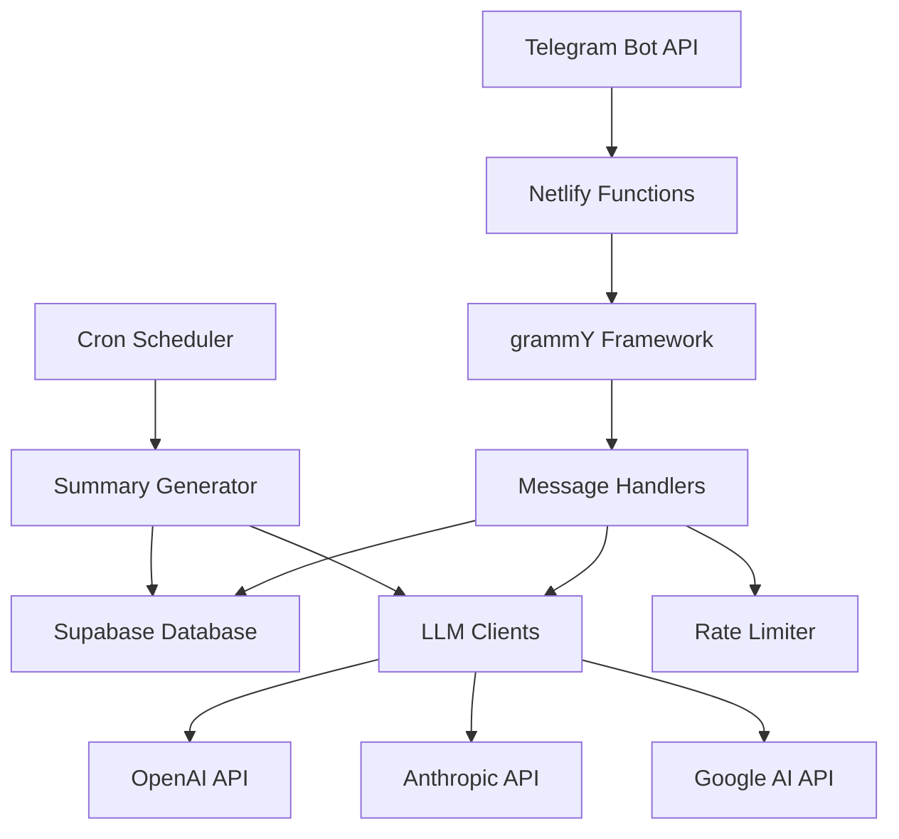

# Telegram AI Bot

A sophisticated Telegram group chat bot powered by multiple LLM providers, offering message summarization, AI image generation, and intelligent conversation management.

## 🎯 Features

### 🤖 Multi-LLM Support
- **OpenAI GPT Models**: GPT-4, GPT-3.5 Turbo with custom configurations
- **Anthropic Claude**: Claude-3 Sonnet and Haiku models
- **Google AI**: Gemini Pro integration
- **Azure OpenAI**: Enterprise-grade AI services
- **Hugging Face**: Open-source model integration
- **Ollama**: Local model support

### 📝 Smart Summarization
- **Automatic Summaries**: Scheduled summaries every 1, 6, or 24 hours
- **On-demand Summaries**: `/summary` command for instant chat summaries
- **Configurable Length**: Customize summary length and detail level
- **Context-aware**: Maintains conversation context and key topics

### 🎨 AI Image Generation
- **Multiple Providers**: DALL-E, Stable Diffusion, Midjourney support
- **Style Presets**: Predefined art styles and filters
- **Queue Management**: Handle multiple image requests efficiently
- **Progress Tracking**: Real-time generation status updates

### ⚡ Advanced Bot Features
- **Rate Limiting**: Smart request throttling per user and chat
- **Admin Controls**: Comprehensive admin commands and settings
- **Multi-language**: Internationalization support
- **Error Recovery**: Robust error handling and retry mechanisms
- **Analytics**: Usage statistics and performance monitoring

## 🏗️ Architecture



## 🚀 Quick Start

### Prerequisites

- Node.js 18.0.0 or higher
- npm or yarn
- Telegram Bot Token (from [@BotFather](https://t.me/botfather))
- Supabase project
- At least one LLM API key

### Installation

1. **Clone the repository**
   ```bash
   git clone https://github.com/yourusername/telegram-ai-bot.git
   cd telegram-ai-bot
   ```

2. **Install dependencies**
   ```bash
   npm install
   ```

3. **Environment setup**
   ```bash
   cp .env.example .env
   # Edit .env with your configuration values
   ```

4. **Database setup**
   ```bash
   # Run SQL scripts in sql/ directory on your Supabase project
   psql -f sql/init.sql
   ```

5. **Development server**
   ```bash
   npm run dev
   ```

### Environment Variables

#### Required Variables

```env
# Telegram Configuration
TELEGRAM_BOT_TOKEN=your_telegram_bot_token_here
TELEGRAM_SECRET_TOKEN=your_webhook_secret_here

# Database
SUPABASE_URL=your_supabase_url_here
SUPABASE_ANON_KEY=your_supabase_anon_key_here

# LLM Provider (at least one required)
OPENAI_API_KEY=your_openai_api_key_here
CLAUDE_API_KEY=your_claude_api_key_here

# Environment
NODE_ENV=development
```

#### Optional Variables

```env
# Additional LLM Providers
GOOGLE_AI_API_KEY=your_google_ai_key
AZURE_OPENAI_ENDPOINT=your_azure_endpoint
HUGGINGFACE_API_KEY=your_hf_key

# Bot Configuration
DEFAULT_SUMMARY_INTERVAL=6
MAX_SUMMARY_LENGTH=2000
MAX_IMAGE_REQUESTS_PER_USER=10
ADMIN_USER_IDS=123456789,987654321

# Rate Limiting
RATE_LIMIT_WINDOW_MS=60000
RATE_LIMIT_MAX_REQUESTS=30

# Scheduling
SUMMARY_CRON_SCHEDULE="0 */6 * * *"
CLEANUP_CRON_SCHEDULE="0 2 * * *"
```

## 📋 Bot Commands

### User Commands

| Command | Description | Example |
|---------|-------------|---------|
| `/start` | Initialize bot for the chat | `/start` |
| `/help` | Show available commands | `/help` |
| `/summary [hours]` | Generate chat summary | `/summary 24` |
| `/image [prompt]` | Generate AI image | `/image sunset over mountains` |
| `/stats` | Show usage statistics | `/stats` |

### Admin Commands

| Command | Description | Example |
|---------|-------------|---------|
| `/settings` | Configure bot settings | `/settings` |
| `/interval [hours]` | Set summary interval | `/interval 6` |
| `/enable` | Enable bot features | `/enable` |
| `/disable` | Disable bot features | `/disable` |
| `/cleanup` | Clean old data | `/cleanup` |

## 🗃️ Database Schema

### Core Tables

```sql
-- Chat configurations
CREATE TABLE chats (
  id BIGINT PRIMARY KEY,
  title VARCHAR(255),
  type VARCHAR(50) DEFAULT 'group',
  settings JSONB DEFAULT '{}',
  is_active BOOLEAN DEFAULT true,
  created_at TIMESTAMP WITH TIME ZONE DEFAULT NOW(),
  updated_at TIMESTAMP WITH TIME ZONE DEFAULT NOW()
);

-- Message storage
CREATE TABLE messages (
  id SERIAL PRIMARY KEY,
  chat_id BIGINT NOT NULL REFERENCES chats(id),
  message_id INTEGER NOT NULL,
  user_id BIGINT NOT NULL,
  username VARCHAR(255),
  first_name VARCHAR(255),
  content TEXT NOT NULL,
  message_type VARCHAR(50) DEFAULT 'text',
  reply_to_message_id INTEGER,
  timestamp TIMESTAMP WITH TIME ZONE DEFAULT NOW(),
  metadata JSONB DEFAULT '{}'
);

-- Generated summaries
CREATE TABLE summaries (
  id SERIAL PRIMARY KEY,
  chat_id BIGINT NOT NULL REFERENCES chats(id),
  summary_text TEXT NOT NULL,
  start_time TIMESTAMP WITH TIME ZONE NOT NULL,
  end_time TIMESTAMP WITH TIME ZONE NOT NULL,
  message_count INTEGER NOT NULL,
  model_used VARCHAR(100),
  tokens_used INTEGER,
  created_at TIMESTAMP WITH TIME ZONE DEFAULT NOW()
);

-- Generated images
CREATE TABLE generated_images (
  id SERIAL PRIMARY KEY,
  chat_id BIGINT NOT NULL REFERENCES chats(id),
  user_id BIGINT NOT NULL,
  message_id INTEGER NOT NULL,
  prompt TEXT NOT NULL,
  image_url VARCHAR(1000),
  thumbnail_url VARCHAR(1000),
  provider VARCHAR(100) NOT NULL,
  model VARCHAR(100),
  style VARCHAR(100),
  dimensions VARCHAR(20) DEFAULT '1024x1024',
  processing_time_ms INTEGER,
  created_at TIMESTAMP WITH TIME ZONE DEFAULT NOW()
);

-- Rate limiting
CREATE TABLE rate_limits (
  id SERIAL PRIMARY KEY,
  user_id BIGINT NOT NULL,
  chat_id BIGINT NOT NULL,
  action_type VARCHAR(50) NOT NULL,
  count INTEGER DEFAULT 1,
  window_start TIMESTAMP WITH TIME ZONE DEFAULT NOW(),
  expires_at TIMESTAMP WITH TIME ZONE NOT NULL
);

-- Usage analytics
CREATE TABLE usage_stats (
  id SERIAL PRIMARY KEY,
  chat_id BIGINT NOT NULL REFERENCES chats(id),
  user_id BIGINT,
  action_type VARCHAR(50) NOT NULL,
  details JSONB DEFAULT '{}',
  timestamp TIMESTAMP WITH TIME ZONE DEFAULT NOW()
);
```

## 📁 Project Structure

```
telegram-ai-bot/
├── .github/                    # GitHub workflows and templates
│   ├── workflows/
│   │   ├── deploy.yml         # CI/CD pipeline
│   │   └── security.yml       # Security scanning
│   ├── ISSUE_TEMPLATE/        # Issue templates
│   └── CONTRIBUTING.md        # Contribution guidelines
├── .vscode/                   # VS Code configuration
│   ├── settings.json
│   ├── launch.json
│   └── extensions.json
├── netlify/
│   └── functions/
│       ├── webhook.ts         # Main webhook handler
│       ├── summary-scheduler.ts # Scheduled summaries
│       ├── handlers/          # Command handlers
│       │   ├── index.ts
│       │   └── commands/
│       │       ├── start.ts
│       │       ├── help.ts
│       │       ├── summary.ts
│       │       ├── settings.ts
│       │       └── stats.ts
│       └── utils/             # Shared utilities
│           ├── database.ts    # Supabase client
│           ├── llm.ts         # LLM integrations
│           ├── telegram.ts    # Telegram helpers
│           └── rate-limiter.ts # Rate limiting
├── src/
│   ├── types/                 # TypeScript definitions
│   │   ├── index.ts
│   │   ├── bot.ts
│   │   ├── database.ts
│   │   ├── llm.ts
│   │   └── telegram.ts
│   └── config/                # Configuration
│       ├── index.ts
│       ├── constants.ts
│       ├── database.ts
│       ├── environment.ts
│       ├── llm.ts
│       └── telegram.ts
├── scripts/                   # Deployment scripts
│   ├── validate-env.js        # Environment validation
│   ├── check-dependencies.js  # Dependency checking
│   └── deploy-check.js        # Pre-deployment checks
├── sql/                       # Database migrations
│   ├── init.sql
│   └── migrations/
├── tests/                     # Test files
│   ├── setup.ts
│   ├── unit/
│   └── integration/
├── docs/                      # Documentation
│   ├── api.md
│   ├── deployment.md
│   └── troubleshooting.md
├── package.json
├── tsconfig.json
├── jest.config.js
├── .eslintrc.json
├── .prettierrc
├── .editorconfig
├── netlify.toml
└── README.md
```

## 🔧 Development

### Scripts

```bash
# Development
npm run dev                    # Start Netlify dev server
npm run build                  # Build TypeScript files
npm run clean                  # Clean build artifacts

# Code Quality
npm run lint                   # Run ESLint
npm run lint:fix              # Fix ESLint errors
npm run format                # Format code with Prettier
npm run format:check          # Check code formatting
npm run type-check            # Run TypeScript checks
npm run validate              # Run all checks

# Testing
npm test                      # Run tests
npm run test:watch           # Run tests in watch mode
npm run test:coverage        # Run tests with coverage

# Deployment
npm run prepare              # Pre-deployment preparation
node scripts/validate-env.js  # Validate environment
node scripts/check-dependencies.js # Check dependencies
node scripts/deploy-check.js # Comprehensive deployment check
npm run deploy               # Deploy to Netlify
```

### Development Workflow

1. **Start development server**
   ```bash
   npm run dev
   ```

2. **Make changes and test**
   ```bash
   npm run validate
   npm test
   ```

3. **Pre-deployment check**
   ```bash
   node scripts/deploy-check.js
   ```

4. **Deploy**
   ```bash
   npm run deploy
   ```

## 🚀 Deployment

### Netlify Deployment

1. **Connect your repository** to Netlify
2. **Set environment variables** in Netlify dashboard
3. **Configure build settings**:
   - Build command: `npm run build`
   - Functions directory: `netlify/functions`
   - Node.js version: 18.x

3. **Deploy**
   ```bash
   npm run deploy
   ```

### Environment Setup

1. **Telegram Bot Setup**
   ```bash
   # Create bot with @BotFather
   # Set webhook URL
   curl -X POST "https://api.telegram.org/bot${TELEGRAM_BOT_TOKEN}/setWebhook" \
     -H "Content-Type: application/json" \
     -d '{
       "url": "https://your-app.netlify.app/.netlify/functions/webhook",
       "secret_token": "your_secret_token",
       "allowed_updates": ["message", "callback_query"],
       "drop_pending_updates": true
     }'
   ```

2. **Database Setup**
   - Create Supabase project
   - Run SQL scripts from `sql/` directory
   - Configure Row Level Security policies

3. **LLM API Setup**
   - Obtain API keys from providers
   - Configure rate limits and usage quotas
   - Test API connectivity

## 📊 Monitoring & Analytics

### Built-in Analytics

- **Usage Statistics**: Command usage, user activity, chat engagement
- **Performance Metrics**: Response times, API latency, error rates
- **Resource Usage**: Token consumption, API costs, database queries

### Health Checks

- **Environment Validation**: Automated checks for configuration issues
- **Dependency Monitoring**: Security vulnerabilities and outdated packages
- **API Health**: Real-time monitoring of external service availability

### Logging

- **Structured Logging**: JSON-formatted logs with correlation IDs
- **Log Levels**: Debug, Info, Warn, Error with configurable thresholds
- **Error Tracking**: Detailed error context and stack traces

## 🔒 Security

### Security Features

- **Webhook Validation**: Secret token verification
- **Rate Limiting**: Per-user and per-chat request throttling
- **Input Sanitization**: Content filtering and validation
- **Admin Controls**: Role-based access control
- **Audit Logging**: Security event tracking

### Best Practices

- **Environment Variables**: Never commit secrets to version control
- **API Key Rotation**: Regular rotation of API keys
- **Database Security**: Row-level security and encrypted connections
- **HTTPS Only**: All communications over secure channels

## 🤝 Contributing

We welcome contributions! Please see [CONTRIBUTING.md](.github/CONTRIBUTING.md) for detailed guidelines.

### Quick Start for Contributors

1. **Fork and clone** the repository
2. **Create a feature branch**: `git checkout -b feature/amazing-feature`
3. **Follow code standards**: Run `npm run validate` before committing
4. **Write tests**: Add tests for new functionality
5. **Submit a pull request**: Use the provided PR template

## 📄 License

This project is licensed under the MIT License - see the [LICENSE](LICENSE) file for details.

## 🆘 Support

### Documentation

- [API Documentation](docs/api.md)
- [Deployment Guide](docs/deployment.md)
- [Troubleshooting](docs/troubleshooting.md)

### Community

- **Issues**: [GitHub Issues](https://github.com/yourusername/telegram-ai-bot/issues)
- **Discussions**: [GitHub Discussions](https://github.com/yourusername/telegram-ai-bot/discussions)
- **Discord**: [Join our Discord](https://discord.gg/your-invite)

### Contact

- **Email**: support@yourproject.com
- **Twitter**: [@yourproject](https://twitter.com/yourproject)

---

Made with ❤️ by the Telegram AI Bot team