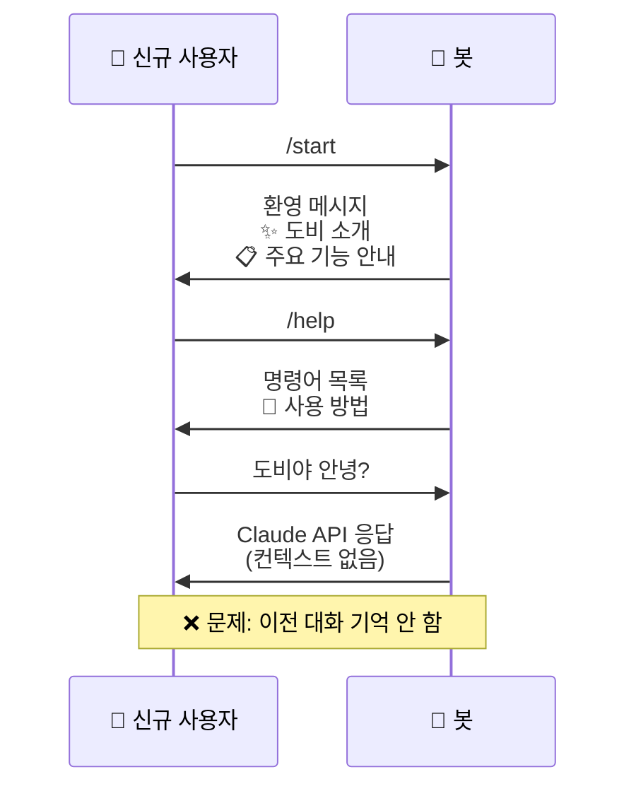
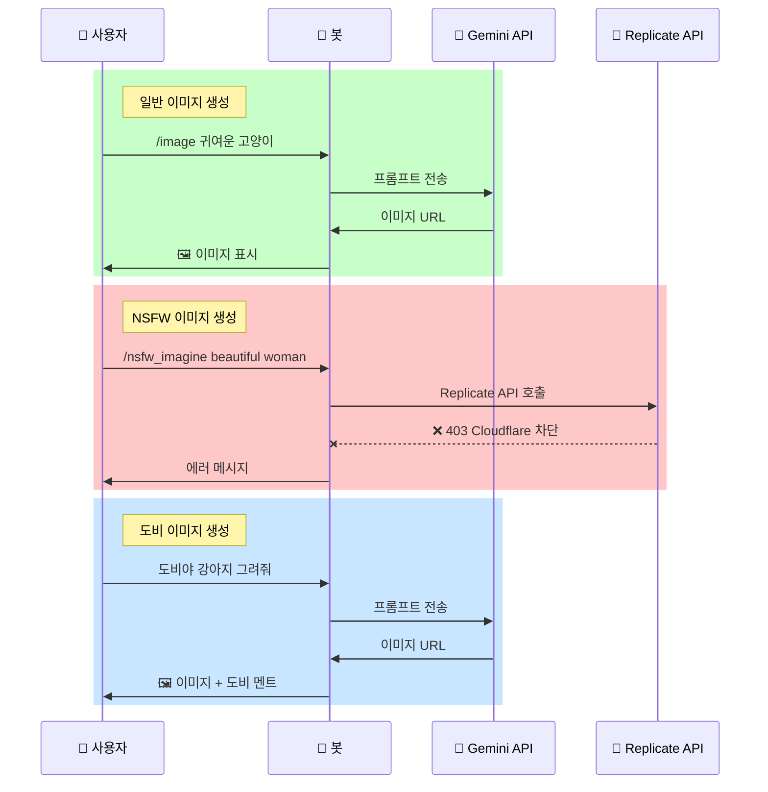
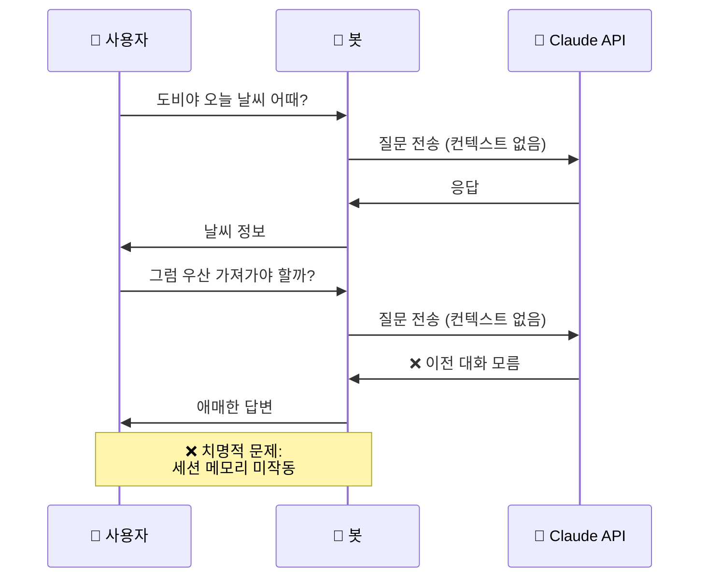

# 🎯 현재 사용자 채팅 경험 분석

## 📊 전체 플로우 (Mermaid Diagram)

```mermaid
graph TB
    Start([사용자 메시지 입력]) --> CheckType{메시지 타입?}

    %% Command Flow
    CheckType -->|명령어| CmdStart[/start 명령어]
    CheckType -->|명령어| CmdHelp[/help 명령어]
    CheckType -->|명령어| CmdImage[/image 명령어]
    CheckType -->|명령어| CmdGenerate[/generate 명령어]
    CheckType -->|명령어| CmdNSFW[/nsfw_imagine, /nsfw_video]
    CheckType -->|명령어| CmdAsk[/ask 명령어]
    CheckType -->|명령어| CmdOther[기타 명령어들]

    %% Text Message Flow
    CheckType -->|일반 텍스트| CheckDobby{도비야 포함?}

    CheckDobby -->|Yes| CheckDobbyHelp{도움말 요청?}
    CheckDobbyHelp -->|Yes| ShowDobbyHelp[도비 도움말 표시]
    CheckDobbyHelp -->|No| CheckImageGen{그려 포함?}

    CheckImageGen -->|Yes| DobbyImageGen[도비 이미지 생성]
    CheckImageGen -->|No| DobbyQA[도비 Q&A]

    CheckDobby -->|No| TrackMessage[대화 추적만 실행]

    %% Command Details
    CmdStart --> ShowWelcome[환영 메시지 표시]
    CmdHelp --> ShowHelp[도움말 표시]
    CmdImage --> GenerateImage[이미지 생성]
    CmdGenerate --> GenerateImage
    CmdNSFW --> GenerateNSFW[NSFW 이미지/비디오 생성]
    CmdAsk --> AskClaude[Claude API 호출]

    %% End States
    ShowWelcome --> End([완료])
    ShowHelp --> End
    GenerateImage --> End
    GenerateNSFW --> End
    AskClaude --> End
    DobbyImageGen --> End
    DobbyQA --> End
    ShowDobbyHelp --> End
    TrackMessage --> End
    CmdOther --> End

    style Start fill:#e1f5e1
    style End fill:#ffe1e1
    style CheckType fill:#fff3cd
    style CheckDobby fill:#d1ecf1
    style CheckDobbyHelp fill:#d1ecf1
    style CheckImageGen fill:#d1ecf1
```

---

## 🎭 사용자 페르소나별 시나리오

### 1️⃣ 신규 사용자 (First-time User)



### 2️⃣ 이미지 생성 사용자



### 3️⃣ 대화형 사용자 (Conversational User)



---

## 📋 현재 명령어 목록

### 기본 명령어
| 명령어 | 기능 | 상태 |
|--------|------|------|
| `/start` | 봇 시작 및 환영 메시지 | ✅ 작동 |
| `/help` | 도움말 표시 | ✅ 작동 |
| `/version` | 버전 정보 | ✅ 작동 |
| `/health` | 헬스 체크 | ✅ 작동 |

### 이미지 생성
| 명령어 | 기능 | 상태 |
|--------|------|------|
| `/image [프롬프트]` | 일반 이미지 생성 (Gemini) | ✅ 작동 |
| `/generate [프롬프트]` | 이미지 생성 (Gemini) | ✅ 작동 |
| `/nsfw_imagine [프롬프트]` | NSFW 이미지 (Replicate) | ❌ Cloudflare 차단 |
| `/nsfw_video [프롬프트]` | NSFW 비디오 (Replicate) | ❌ Cloudflare 차단 |

### 대화형 기능
| 명령어 | 기능 | 상태 |
|--------|------|------|
| `/ask [질문]` | Claude Q&A | ✅ 작동 (세션 없음) |
| `도비야 [질문]` | 도비 Q&A | ⚠️ 세션 메모리 미작동 |
| `도비야 [설명] 그려줘` | 도비 이미지 생성 | ✅ 작동 |
| `도비야 도움말` | 도비 도움말 | ✅ 작동 |

### 관리 명령어
| 명령어 | 기능 | 상태 |
|--------|------|------|
| `/track_start` | 대화 추적 시작 | ✅ 작동 |
| `/track_stop` | 대화 추적 중지 | ✅ 작동 |
| `/track_status` | 추적 상태 확인 | ✅ 작동 |
| `/summary` | 대화 요약 | ✅ 작동 |
| `/summarize` | 대화 요약 (별칭) | ✅ 작동 |
| `/maintenance` | 유지보수 모드 | ✅ 작동 (관리자만) |

---

## 🔍 사용자 행동 패턴 분석

### Pattern 1: 명령어 우선 사용자
```
/start → /help → /image 고양이 → /generate 강아지
```
- **특징**: 명령어로만 소통
- **경험**: 기계적, 명확함
- **문제점**: 명령어 외 자연스러운 대화 불가

### Pattern 2: 도비 의존형 사용자
```
도비야 안녕 → 도비야 뭐 해? → 도비야 그림 그려줘
```
- **특징**: 모든 상호작용에 "도비야" 사용
- **경험**: 친근함, 대화형
- **문제점**: 연속 대화 시 컨텍스트 유실

### Pattern 3: 혼합형 사용자
```
/start → 도비야 안녕 → /image 고양이 → 도비야 이거 귀엽다
```
- **특징**: 명령어 + 자연어 혼용
- **경험**: 가장 자연스러움
- **문제점**: 도비 대화에서만 컨텍스트 단절

---

## ❌ 주요 문제점 (Critical Issues)

### 1. 세션 메모리 미작동 🔴 (최우선 해결 과제)
```typescript
// 현재 상황
사용자: "도비야 오늘 날씨 어때?"
도비: "맑습니다"

사용자: "그럼 우산 필요없겠네?"
도비: "무엇에 대한 우산을 말씀하시는지요?" ❌

// 원인
- SessionManager 구현되어 있으나 webhook.ts에서 미사용
- 매번 새로운 대화로 처리
```

### 2. NSFW 기능 차단 🟡
```
Cloudflare가 Render.com IP 차단
→ Replicate 지원팀 문의 중
```

### 3. 파편화된 사용자 경험 🟡
```
- 명령어 방식: /image
- 도비 방식: 도비야 그려줘
- Ask 방식: /ask

→ 3가지 다른 인터페이스, 일관성 부족
```

### 4. 이미지 편집 기능 부재 🟡
```
- 프롬프트 템플릿 38개 준비됨
- /edit 명령어 미구현
- 사용자가 접근 불가
```

---

## 📈 현재 기능별 완성도

```mermaid
gantt
    title 기능별 구현 완성도
    dateFormat X
    axisFormat %s

    section 기본 기능
    환영/도움말           :done, 0, 100
    버전/헬스체크         :done, 0, 100

    section 이미지 생성
    Gemini 이미지 생성    :done, 0, 100
    Replicate NSFW        :crit, 0, 30

    section 대화 기능
    기본 Q&A             :done, 0, 80
    세션 메모리          :crit, 0, 10
    도비 캐릭터          :done, 0, 90

    section 이미지 편집
    프롬프트 템플릿      :done, 0, 100
    /edit 명령어         :0, 0
    이미지 분석          :0, 0

    section 관리 기능
    대화 추적            :done, 0, 100
    요약 기능            :done, 0, 100
```



---

## 🎯 사용자 경험 개선 우선순위

### 🔴 Critical (즉시 해결 필요)
1. **세션 메모리 활성화** - 연속 대화 가능하게
2. **NSFW Cloudflare 이슈** - Replicate 응답 대기

### 🟡 High (단기 개선)
3. **이미지 편집 기능 구현** - `/edit` 명령어
4. **UI/UX 통합** - 파편화된 인터페이스 정리
5. **에러 핸들링 개선** - 사용자 친화적 메시지

### 🟢 Medium (중기 개선)
6. **프롬프트 추천 시스템** - 이미지 분석 기반
7. **사용자 온보딩** - 단계별 튜토리얼
8. **통계 대시보드** - 사용 패턴 분석

---

## 💡 다음 단계 제안

현재 채팅 경험을 재설계하여:

1. **통합 인터페이스 설계**
   - 명령어 + 자연어 혼합
   - 일관된 사용자 경험

2. **세션 메모리 우선 수정**
   - SessionManager 통합
   - 컨텍스트 유지

3. **이미지 편집 기능 완성**
   - `/edit` 구현
   - 38개 템플릿 활용

4. **사용자 플로우 최적화**
   - 단계 축소
   - 명확한 피드백

다음 작업으로 **개선된 사용자 경험 설계**를 진행할까요?
