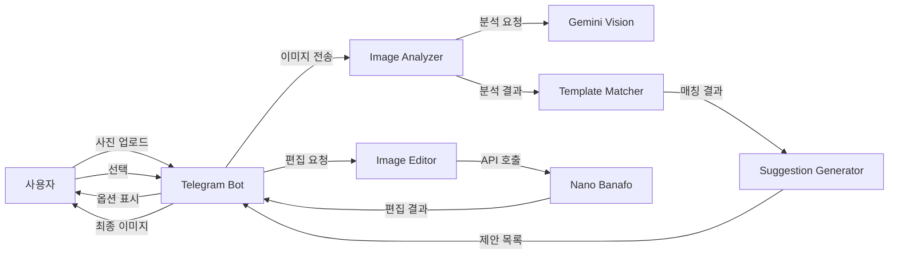

# 📸 AI 기반 지능형 사진 편집 기능 구현 계획서

## 📌 프로젝트 개요

### 목적
사용자가 업로드한 사진을 AI가 자동으로 분석하여, 맞춤형 편집 옵션을 제안하고 선택한 옵션으로 자동 편집하는 지능형 사진 편집 시스템 구축

### 핵심 기능
1. **자동 이미지 분석** - 업로드된 이미지의 내용, 구성, 품질 자동 분석
2. **맞춤형 편집 제안** - 분석 결과에 기반한 최적화된 편집 옵션 제시
3. **원클릭 편집 실행** - 선택한 옵션으로 즉시 편집 수행

### 기술 스택
- **이미지 분석**: Gemini Vision API
- **이미지 편집**: Nano Banafo API (예정)
- **데이터베이스**: Supabase (PostgreSQL)
- **플랫폼**: Telegram Bot (grammY framework)
- **런타임**: Node.js (Render.com)

---

## 🏗️ 시스템 아키텍처

### 1. 데이터 플로우



### 2. 컴포넌트 구조

```
telegram-ai-bot/
├── src/
│   ├── services/
│   │   ├── image-analysis/
│   │   │   ├── analyzer.ts         # 이미지 분석 메인 클래스
│   │   │   ├── face-detector.ts    # 얼굴 감지 및 분석
│   │   │   ├── scene-analyzer.ts   # 장면 및 객체 분석
│   │   │   └── quality-checker.ts  # 이미지 품질 평가
│   │   │
│   │   ├── edit-templates/
│   │   │   ├── template-manager.ts # 템플릿 관리
│   │   │   ├── template-matcher.ts # 조건 매칭 엔진
│   │   │   └── prompt-builder.ts   # 동적 프롬프트 생성
│   │   │
│   │   ├── edit-suggestion/
│   │   │   ├── suggestion-engine.ts # 제안 생성 엔진
│   │   │   ├── ranking-algorithm.ts # 우선순위 알고리즘
│   │   │   └── personalization.ts   # 사용자별 맞춤화
│   │   │
│   │   └── image-editor/
│   │       ├── nano-banafo-client.ts # Nano Banafo API 클라이언트
│   │       ├── edit-executor.ts      # 편집 실행 관리
│   │       └── result-processor.ts   # 결과 후처리
│   │
│   ├── handlers/
│   │   └── image-edit-handler.ts   # Telegram 명령어 핸들러
│   │
│   └── types/
│       └── image-edit.types.ts     # TypeScript 타입 정의
│
├── sql/
│   └── 008_image_edit_schema.sql   # 데이터베이스 스키마
│
└── docs/
    ├── IMAGE_EDIT_FEATURE_PLAN.md  # 본 문서
    ├── PROMPT_TEMPLATES.md          # 프롬프트 템플릿 목록
    └── IMPLEMENTATION_TASKS.md      # 구현 작업 목록
```

---

## 💾 데이터베이스 설계

### 핵심 테이블

#### 1. `image_edit_templates` - 편집 템플릿
```sql
CREATE TABLE image_edit_templates (
    id SERIAL PRIMARY KEY,
    template_key VARCHAR(50) UNIQUE NOT NULL,
    template_name TEXT NOT NULL,
    category VARCHAR(50) NOT NULL,
    subcategory VARCHAR(50),
    description TEXT,

    -- 템플릿 프롬프트
    base_prompt TEXT NOT NULL,
    prompt_variables JSONB DEFAULT '{}',
    example_prompts TEXT[],

    -- 적용 조건
    min_images INTEGER DEFAULT 1,
    max_images INTEGER DEFAULT 1,
    required_conditions JSONB DEFAULT '{}',
    optimal_conditions JSONB DEFAULT '{}',

    -- 메타데이터
    priority INTEGER DEFAULT 0,
    success_rate DECIMAL(5,2),
    usage_count INTEGER DEFAULT 0,
    is_active BOOLEAN DEFAULT TRUE,

    -- 타임스탬프
    created_at TIMESTAMPTZ DEFAULT NOW(),
    updated_at TIMESTAMPTZ DEFAULT NOW()
);
```

#### 2. `image_analysis_results` - 분석 결과 저장
```sql
CREATE TABLE image_analysis_results (
    id SERIAL PRIMARY KEY,
    session_id UUID NOT NULL,
    user_id BIGINT NOT NULL,
    chat_id BIGINT NOT NULL,

    -- 이미지 정보
    image_count INTEGER NOT NULL,
    image_metadata JSONB NOT NULL,

    -- 분석 결과
    analysis_data JSONB NOT NULL,
    detected_categories TEXT[],
    confidence_scores JSONB,

    -- 처리 정보
    processing_time_ms INTEGER,
    api_used VARCHAR(50),

    created_at TIMESTAMPTZ DEFAULT NOW()
);
```

#### 3. `edit_suggestions` - 생성된 제안
```sql
CREATE TABLE edit_suggestions (
    id SERIAL PRIMARY KEY,
    analysis_id INTEGER REFERENCES image_analysis_results(id),

    -- 제안 목록
    suggestions JSONB NOT NULL,
    selected_template_id INTEGER,
    user_feedback VARCHAR(20),

    created_at TIMESTAMPTZ DEFAULT NOW()
);
```

#### 4. `edit_history` - 편집 이력
```sql
CREATE TABLE edit_history (
    id SERIAL PRIMARY KEY,
    user_id BIGINT NOT NULL,
    chat_id BIGINT NOT NULL,
    suggestion_id INTEGER REFERENCES edit_suggestions(id),

    -- 편집 정보
    template_used VARCHAR(50),
    final_prompt TEXT,
    custom_modifications TEXT,

    -- 결과
    original_image_urls TEXT[],
    edited_image_url TEXT,
    processing_time_ms INTEGER,

    -- 피드백
    user_rating INTEGER CHECK (user_rating >= 1 AND user_rating <= 5),
    user_comment TEXT,

    created_at TIMESTAMPTZ DEFAULT NOW()
);
```

---

## 🎨 편집 템플릿 카테고리

### 1. 인물 사진 (Portrait) - 1장
- **professional_headshot**: 전문 프로필 사진
- **id_photo**: 증명사진 스타일
- **artistic_portrait**: 예술적 초상화
- **character_transform**: 캐릭터/피규어 변환
- **vintage_portrait**: 빈티지 스타일 초상화

### 2. 그룹/합성 (Composite) - 2장+
- **people_merge**: 인물 합성 (악수, 포옹 등)
- **group_collage**: 그룹 콜라주
- **family_portrait**: 가족사진 스타일
- **team_photo**: 팀 사진 합성

### 3. 패션/스타일 (Fashion) - 인물+의류
- **virtual_fitting**: 가상 피팅
- **style_transfer**: 스타일 변경
- **outfit_swap**: 의상 교체
- **fashion_shoot**: 패션 화보 스타일

### 4. 창의적 편집 (Creative)
- **cartoon_style**: 만화/애니메이션 스타일
- **movie_poster**: 영화 포스터
- **historical_art**: 역사적 예술 작품 스타일
- **fantasy_scene**: 판타지 장면 생성

### 5. 배경/환경 (Environment)
- **background_replace**: 배경 교체
- **scene_integration**: 장면 통합
- **travel_composite**: 여행 사진 합성
- **studio_backdrop**: 스튜디오 배경

---

## 🔄 처리 워크플로우

### Phase 1: 이미지 수신 및 초기 처리
```typescript
interface ImageReceivePhase {
    1. 이미지 수신 및 검증
    2. 파일 크기 및 포맷 확인
    3. 임시 저장 및 URL 생성
    4. 세션 ID 생성
}
```

### Phase 2: 이미지 분석
```typescript
interface ImageAnalysisPhase {
    1. Gemini Vision API 호출
    2. 얼굴 감지 및 개수 확인
    3. 객체 및 장면 인식
    4. 구성 및 품질 평가
    5. 분석 결과 구조화 및 저장
}
```

### Phase 3: 편집 제안 생성
```typescript
interface SuggestionGenerationPhase {
    1. 분석 결과와 템플릿 조건 매칭
    2. 신뢰도 점수 계산
    3. 사용자 이력 기반 개인화
    4. 상위 3-5개 옵션 선정
    5. 인라인 키보드 생성
}
```

### Phase 4: 사용자 선택 처리
```typescript
interface UserSelectionPhase {
    1. 선택된 템플릿 확인
    2. 추가 커스터마이징 옵션 제시
    3. 최종 프롬프트 생성
    4. 사용자 확인
}
```

### Phase 5: 편집 실행
```typescript
interface EditExecutionPhase {
    1. Nano Banafo API 호출 준비
    2. 이미지 및 프롬프트 전송
    3. 진행 상황 업데이트
    4. 결과 수신 및 검증
    5. 후처리 (크기 조정, 포맷 변환 등)
}
```

### Phase 6: 결과 전달
```typescript
interface ResultDeliveryPhase {
    1. 편집된 이미지 전송
    2. 피드백 요청
    3. 이력 저장
    4. 통계 업데이트
}
```

---

## 📊 성능 목표 및 지표

### 핵심 성능 지표 (KPI)
| 지표 | 목표 | 측정 방법 |
|------|------|----------|
| 이미지 분석 정확도 | 90% 이상 | 수동 검증 샘플링 |
| 제안 적중률 | 70% 이상 | 사용자 선택률 |
| 편집 성공률 | 85% 이상 | API 성공 응답률 |
| 전체 처리 시간 | 30초 이내 | 평균 응답 시간 |
| 사용자 만족도 | 4.0/5.0 이상 | 피드백 평점 |

### 시스템 제약 사항
- 최대 이미지 크기: 20MB
- 지원 포맷: JPEG, PNG, WebP
- 동시 처리: 사용자당 1건
- API 타임아웃: 30초
- 일일 한도: 사용자당 50건

---

## 🚀 배포 및 운영

### 환경 변수
```bash
# 필수 API 키
NANO_BANAFO_API_KEY=
GEMINI_API_KEY=
SUPABASE_URL=
SUPABASE_ANON_KEY=

# 설정값
MAX_IMAGE_SIZE_MB=20
EDIT_TIMEOUT_SECONDS=30
MAX_DAILY_EDITS_PER_USER=50
```

### 모니터링 항목
1. API 응답 시간
2. 오류율 및 오류 유형
3. 일일 사용량
4. 템플릿별 성공률
5. 사용자 피드백 점수

### 에러 처리 전략
- API 타임아웃: 재시도 (최대 2회)
- 이미지 크기 초과: 자동 리사이징
- API 한도 초과: 큐잉 시스템
- 편집 실패: 대체 템플릿 제안

---

## 📝 추가 고려사항

### 보안
- 이미지 임시 저장 후 자동 삭제 (24시간)
- 사용자 개인정보 보호
- API 키 암호화 저장

### 확장성
- 템플릿 동적 추가/수정 가능
- 다국어 지원 준비
- 플러그인 구조로 새로운 편집 엔진 추가 가능

### 사용자 경험
- 진행 상황 실시간 업데이트
- 편집 미리보기 옵션
- 편집 히스토리 및 재편집 기능

---

## 📅 구현 일정

### Week 1: 기초 인프라
- [ ] 데이터베이스 스키마 생성
- [ ] 기본 타입 정의
- [ ] 서비스 클래스 구조 설계

### Week 2: 분석 시스템
- [ ] Gemini Vision 통합
- [ ] 이미지 분석 서비스 구현
- [ ] 분석 결과 저장 로직

### Week 3: 제안 시스템
- [ ] 템플릿 매칭 엔진
- [ ] 제안 생성 알고리즘
- [ ] 인라인 키보드 UI

### Week 4: 편집 실행
- [ ] Nano Banafo API 통합
- [ ] 편집 실행 서비스
- [ ] 결과 처리 및 전송

### Week 5: 최적화 및 테스트
- [ ] 성능 최적화
- [ ] 통합 테스트
- [ ] 사용자 피드백 반영

---

*문서 작성일: 2024년 12월*
*버전: 1.0.0*