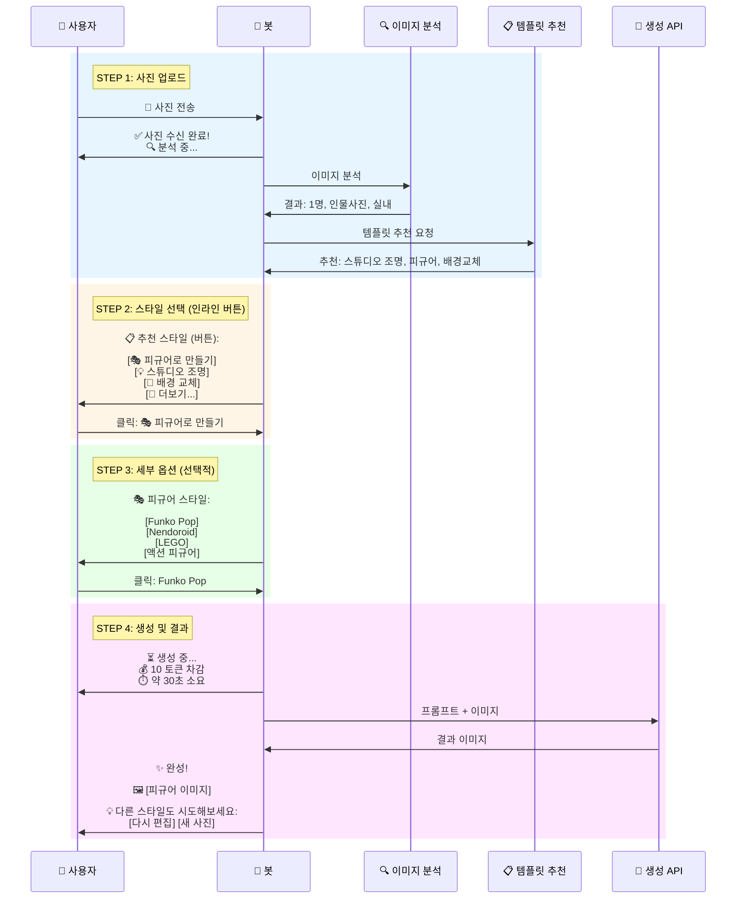
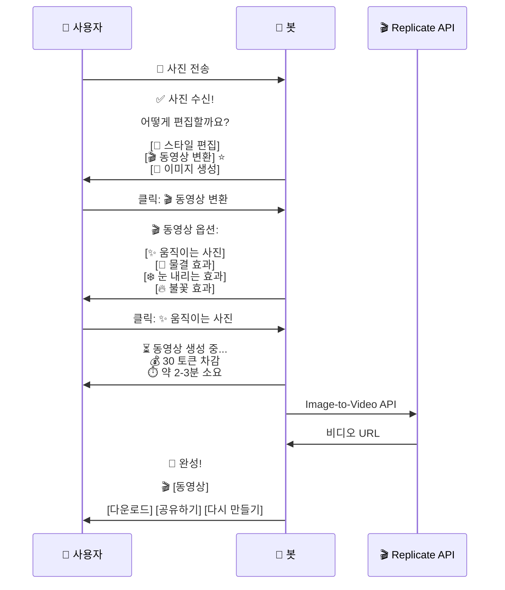
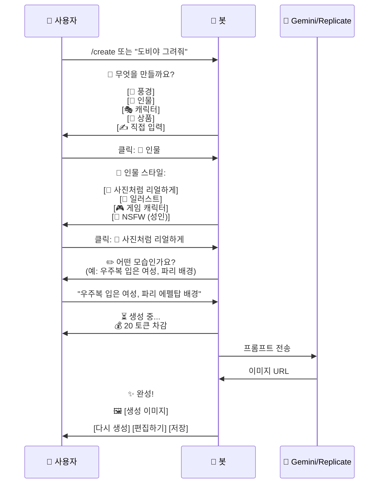
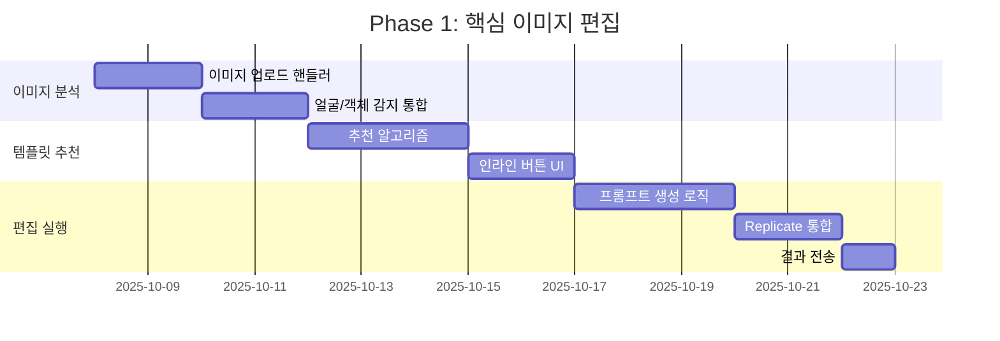

# 🎨 개선된 이미지 편집/생성 서비스 UX 설계

## 🎯 서비스 핵심 정의

### 우선순위
1. **🥇 이미지 편집** (핵심) - 사진 → 편집본/동영상
2. **🥈 이미지/영상 생성** (부가) - 텍스트 → 이미지/영상
3. **🥉 AI 상담** (지원) - 질문 → 답변

### 수익 모델
- Telegram Stars 기반 과금
- 편집/생성당 토큰 차감

---

## 📱 최적의 텔레그램 UX 시나리오

### 🌟 시나리오 1: 사진 편집 (Primary Flow)



### 🎬 시나리오 2: 이미지 → 동영상 변환



### 🆕 시나리오 3: 텍스트 → 이미지 생성



---

## 🎛️ 개선된 인터페이스 설계

### 1. 메인 메뉴 (항상 접근 가능)

```
/start 실행 시 또는 /menu

┌─────────────────────────────┐
│   🎨 Pixie - AI 포토 스튜디오   │
├─────────────────────────────┤
│                             │
│  📸 사진 편집하기             │
│  🎬 동영상 만들기             │
│  🎨 이미지 생성하기            │
│  ━━━━━━━━━━━━━━━━━━━━━━━━━   │
│  💬 AI 상담                  │
│  💰 토큰 충전                │
│  📊 내 사용 내역              │
│  ⚙️ 설정                     │
└─────────────────────────────┘
```

### 2. 사진 업로드 → 스마트 추천

```python
# 사진 업로드 시 자동 분석 후 추천

사용자: [사진 전송]

봇:
┌─────────────────────────────┐
│ ✅ 사진을 받았어요!           │
│                             │
│ 🔍 분석 결과:                │
│ • 인물 1명 감지               │
│ • 전신 사진                   │
│ • 실내, 자연광                │
└─────────────────────────────┘

🎯 추천 스타일 (인기순):

[🎭 피규어 만들기] ⭐⭐⭐⭐⭐
[💡 프로 조명 적용] ⭐⭐⭐⭐
[🌃 멋진 배경으로 교체] ⭐⭐⭐⭐
[🎬 움직이는 사진으로] ⭐⭐⭐

[🔍 전체 38개 스타일 보기]
```

### 3. 카테고리별 템플릿 브라우징

```
[🔍 전체 38개 스타일 보기] 클릭 시:

┌─────────────────────────────┐
│   📂 스타일 카테고리          │
├─────────────────────────────┤
│                             │
│  🎭 피규어/장난감 (5개)       │
│  ├ Funko Pop                │
│  ├ Nendoroid               │
│  ├ LEGO                    │
│  └ ...                     │
│                             │
│  📸 인물 스타일 (12개)        │
│  ├ 스튜디오 조명              │
│  ├ 사이버펑크                │
│  └ ...                     │
│                             │
│  🎮 게임/애니 (2개)           │
│  🛠️ 편집 도구 (11개)          │
│  ✨ 창의적 변환 (3개)          │
└─────────────────────────────┘
```

### 4. 토큰 시스템 (명확한 가격 표시)

```
┌─────────────────────────────┐
│   💰 토큰 가격                │
├─────────────────────────────┤
│                             │
│  📸 사진 편집:    10 토큰     │
│  🎬 동영상 변환:  30 토큰     │
│  🎨 이미지 생성:  20 토큰     │
│  🔞 NSFW 생성:   50 토큰     │
│                             │
│  ━━━━━━━━━━━━━━━━━━━━━━━━━   │
│                             │
│  💎 토큰 구매:                │
│  • 100 토큰 = ⭐ 50 Stars   │
│  • 500 토큰 = ⭐ 200 Stars  │
│  • 1000 토큰 = ⭐ 350 Stars │
│                             │
│  [토큰 충전하기]              │
└─────────────────────────────┘

현재 보유: 💰 45 토큰
```

---

## 🚀 구현 우선순위 & 로드맵

### Phase 1: 핵심 이미지 편집 (1-2주)


**목표 기능:**
- ✅ 사진 업로드 → 자동 분석
- ✅ 스마트 템플릿 추천 (상위 3-5개)
- ✅ 인라인 버튼으로 빠른 선택
- ✅ 38개 템플릿 모두 접근 가능
- ✅ 결과 이미지 전송

### Phase 2: 동영상 변환 (1주)
**목표 기능:**
- ✅ Image-to-Video (Replicate Stable Video Diffusion)
- ✅ 여러 효과 옵션
- ✅ 진행 상황 표시

### Phase 3: 토큰 시스템 (1주)
**목표 기능:**
- ✅ Telegram Stars 결제 통합
- ✅ 토큰 잔액 관리
- ✅ 사용 내역 추적
- ✅ 무료 체험 (신규 사용자 50 토큰)

### Phase 4: UX 최적화 (1주)
**목표 기능:**
- ✅ 온보딩 튜토리얼
- ✅ 인기 스타일 하이라이트
- ✅ 빠른 재시도/수정
- ✅ 갤러리 기능 (내가 만든 작품)

---

## 💡 핵심 UX 개선 포인트

### 1. **원클릭 편집**
```
❌ 기존: 명령어 입력 → 파라미터 설명 → 실행
✅ 개선: 사진 전송 → 버튼 클릭 → 완료
```

### 2. **스마트 추천**
```
❌ 기존: 38개 템플릿 중 어떤 걸 써야 할지 모름
✅ 개선: AI가 사진 분석해서 최적 3-5개 추천
```

### 3. **명확한 피드백**
```
❌ 기존: "처리 중..." (언제 끝날지 모름)
✅ 개선: "⏳ 생성 중... 약 30초 소요 (15/30초)"
```

### 4. **빠른 반복**
```
❌ 기존: 처음부터 다시 시작
✅ 개선: [다시 생성] [다른 스타일] [수정하기]
```

### 5. **과금 투명성**
```
❌ 기존: 사용 후 과금
✅ 개선: 버튼 클릭 전 "💰 10 토큰 사용됩니다" 표시
```

---

## 🎨 실제 대화 플로우 예시

### 예시 1: 완벽한 플로우 (신규 사용자)

```
👤: /start

🤖:
┌─────────────────────────────┐
│  ✨ Pixie에 오신 걸 환영해요! │
│                             │
│  AI가 당신의 사진을           │
│  마법처럼 변신시켜드려요!      │
│                             │
│  🎁 신규 가입 선물:           │
│     💰 50 토큰 무료 증정!    │
└─────────────────────────────┘

📸 사진 하나를 보내주세요!
(또는 /create로 새로 만들기)

---

👤: [셀카 사진 전송]

🤖:
✅ 사진을 받았어요!

🔍 분석 결과:
• 인물 1명 (얼굴 정면)
• 반신 사진
• 실내, 따뜻한 조명

🎯 이 사진에 어울리는 스타일:

[🎭 Funko Pop 피규어] (💰 10 토큰)
[💡 스튜디오 프로 조명] (💰 10 토큰)
[🌃 파리 에펠탑 배경] (💰 10 토큰)
[🎬 움직이는 사진] (💰 30 토큰)

[🔍 38개 전체 스타일 보기]

---

👤: [클릭: 🎭 Funko Pop 피규어]

🤖:
🎭 피규어 스타일을 선택하세요:

[Funko Pop] - 큰 머리, 귀여운 스타일
[Nendoroid] - 치비 캐릭터, 애니메이션
[LEGO] - 레고 미니피규어
[액션 피규어] - 리얼한 상업용 피규어

---

👤: [클릭: Funko Pop]

🤖:
⏳ Funko Pop 피규어 생성 중...

💰 10 토큰 차감 (잔액: 40 토큰)
⏱️ 약 30초 소요 (15/30초)

━━━━━━━━━━━━━━━━ 50%

---

🤖:
✨ 완성되었어요!

🖼️ [Funko Pop 스타일 피규어 이미지]

💡 마음에 드시나요?

[💾 저장] [🔄 다시 만들기]
[🎨 다른 스타일 시도] [📤 공유]

━━━━━━━━━━━━━━━━━━━━━━━
🎁 친구 초대하면 무료 토큰 증정!
[친구 초대하기]
```

---

## 📊 성공 지표 (KPI)

### 사용자 경험 지표
- **전환율**: 사진 업로드 → 편집 완료 (목표 >80%)
- **재사용률**: 1주일 내 재방문 (목표 >60%)
- **평균 작업 시간**: 업로드 → 완료 (목표 <2분)

### 비즈니스 지표
- **토큰 구매 전환율**: 무료 사용 → 첫 구매 (목표 >15%)
- **ARPU**: 사용자당 평균 매출 (목표 ⭐ 100 Stars/월)
- **추천 클릭률**: AI 추천 사용률 (목표 >70%)

---

## 🎯 다음 단계 실행 계획

### Step 1: 이미지 업로드 핸들러 구현
```typescript
// 사진 메시지 수신 → 분석 → 추천
bot.on('message:photo', async (ctx) => {
  // 1. 사진 다운로드
  // 2. 이미지 분석 (얼굴, 객체, 장면)
  // 3. 템플릿 추천 (상위 3-5개)
  // 4. 인라인 버튼으로 표시
});
```

### Step 2: 인라인 키보드 UI
```typescript
// 버튼 클릭 → 템플릿 선택 → 생성
bot.callbackQuery(/template_(.+)/, async (ctx) => {
  const templateId = ctx.match[1];
  // 1. 템플릿 정보 조회
  // 2. 세부 옵션 표시 (있다면)
  // 3. 최종 확인 → 생성 시작
});
```

### Step 3: 프롬프트 생성 & API 호출
```typescript
// 템플릿 + 이미지 → 최종 프롬프트
async function generateImage(template, imageUrl, options) {
  // 1. 템플릿에서 base_prompt 가져오기
  // 2. 변수 치환
  // 3. Replicate/Gemini API 호출
  // 4. 결과 반환
}
```

**시작할까요?** 어떤 단계부터 구현하시겠습니까?

1. 이미지 업로드 핸들러 구현
2. 템플릿 추천 시스템 구축
3. 인라인 UI 설계
4. 전체 플로우 한 번에 구현
