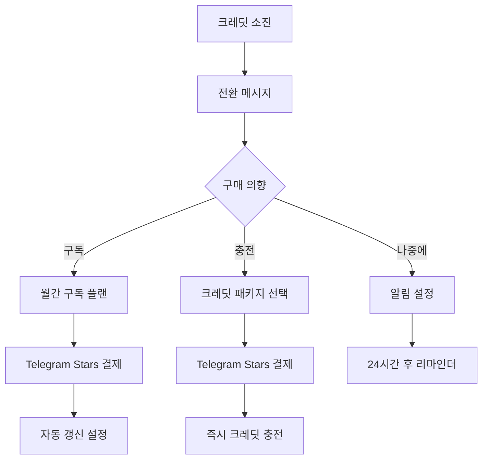
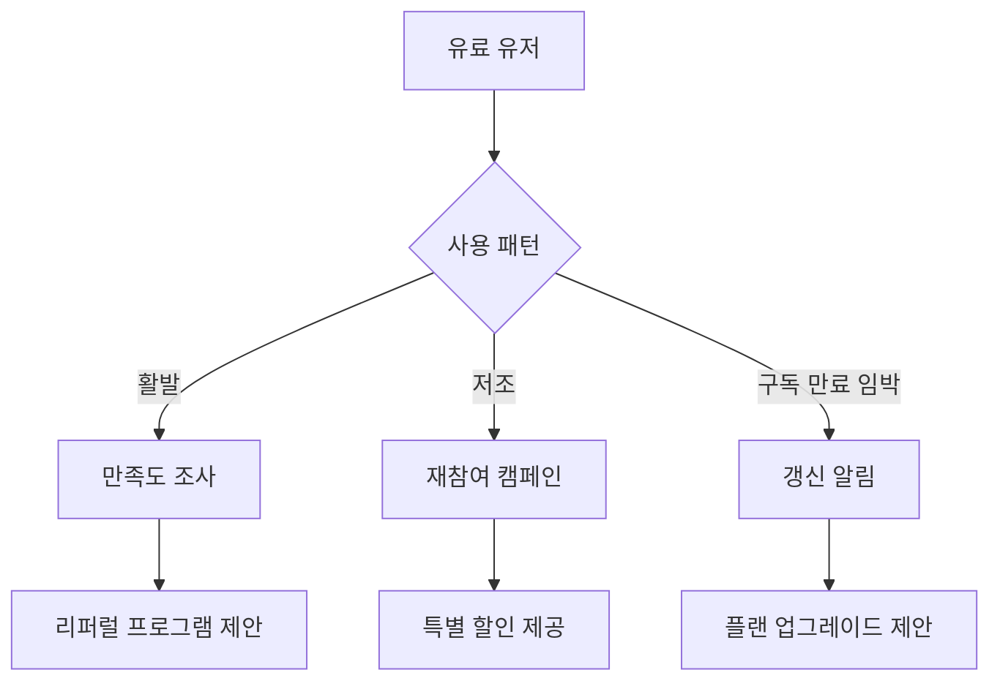
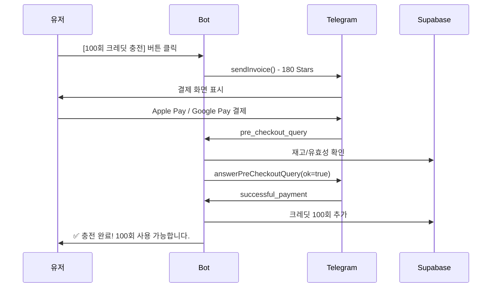
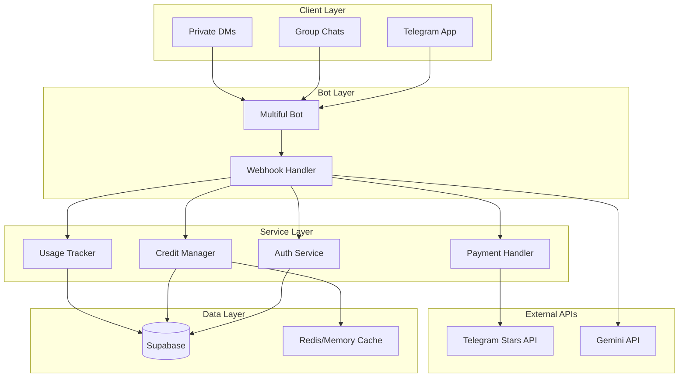

# 🎯 Multiful AI Bot 과금 시스템 설계

## 📋 목차
1. [전략 개요](#전략-개요)
2. [Telegram API 활용](#telegram-api-활용)
3. [사용자 여정 (User Journey)](#사용자-여정)
4. [기술 아키텍처](#기술-아키텍처)
5. [데이터베이스 스키마](#데이터베이스-스키마)
6. [구현 우선순위](#구현-우선순위)

---

## 🎯 전략 개요

### 비즈니스 목표
- **바이럴 마케팅**: 그룹 채팅에서 데모 → 개인 사용자 전환
- **Freemium 모델**: 무료 체험 → 유료 전환
- **사용량 기반 과금**: 이미지 편집 횟수에 따른 차등 과금

### 핵심 전략
```
그룹 채팅 데모 → 관심 유도 → 개인 DM → 무료 체험 → 유료 구독/충전
```

---

## 🔧 Telegram API 활용

### 1. **Telegram Stars** (추천 ⭐)
**장점:**
- Telegram 네이티브 결제 시스템
- 개인정보 입력 불필요 (매끄러운 UX)
- 구독 기능 지원
- Apple Pay, Google Pay 연동
- TON으로 출금 가능

**활용 방법:**
```typescript
// Invoice 생성
await bot.api.sendInvoice(
  chatId,
  title: "✨ 프리미엄 플랜",
  description: "100회 AI 이미지 편집 크레딧",
  payload: "premium_100_credits",
  currency: "XTR", // Telegram Stars
  prices: [{ label: "100 크레딧", amount: 500 }] // 500 stars
);
```

### 2. **Bot Login Widget**
사용자 인증 및 회원가입:
```typescript
// Telegram Login 검증
const telegramUser = {
  id: user.id,
  first_name: user.first_name,
  username: user.username,
  photo_url: user.photo_url,
  auth_date: user.auth_date,
  hash: user.hash
};
```

### 3. **Deep Linking**
그룹에서 → 개인 DM으로 전환:
```
https://t.me/MultifulDobi_bot?start=group_demo_abc123
```

### 4. **Inline Keyboards**
구매/구독 버튼 제공

---

## 🚶 사용자 여정 (User Journey)

### Phase 1: 발견 (Discovery)
```mermaid
flowchart TD
    A[그룹 채팅] -->|봇 초대| B[누군가 사진 업로드]
    B --> C[AI 편집 데모 결과 공유]
    C --> D{관심 생김}
    D -->|Yes| E[개인 DM 시작]
    D -->|No| F[구경만]
    E --> G[/start 명령어]
```

### Phase 2: 온보딩 (Onboarding)
```mermaid
flowchart TD
    A[/start in DM] --> B{신규 유저?}
    B -->|Yes| C[환영 메시지 + 무료 체험 안내]
    B -->|No| D[기존 크레딧 확인]

    C --> E[무료 크레딧 지급: 5회]
    E --> F[튜토리얼: 사진 업로드 유도]
    F --> G[첫 편집 성공!]
    G --> H[남은 크레딧: 4회]

    D --> I{크레딧 남음?}
    I -->|Yes| J[계속 사용]
    I -->|No| K[충전/구독 안내]
```

### Phase 3: 전환 (Conversion)


### Phase 4: 유지 (Retention)


---

## 🎨 UX Flow 상세

### 1. 그룹 채팅에서의 행동 (FOMO 전략 🎯)

#### 시나리오 A: 등록 유저가 그룹에서 사진 업로드
```
👤 김철수 (등록 유저): [사진 업로드]
🤖 Multiful AI Bot:
   📸 이미지 분석 완료!

   ✨ AI 추천 스타일:
   [🎭 3D 피규어] [📸 레드카펫] [🎮 게임 캐릭터]

👤 박영희 (비등록): [3D 피규어] 버튼 클릭
🤖 Multiful AI Bot: (그룹에 공개 메시지)
   ✨ 박영희님이 "3D 피규어" 스타일을 선택했습니다!
   🎨 AI가 작업 중... (약 10초 소요)

   [편집 결과 이미지 전송]

   ✅ 편집 완료! 첫 무료 체험을 사용하셨습니다.
   💡 더 많은 편집을 원하시면 개인 대화로 가입하세요!

   [🚀 지금 가입하고 5회 더 받기]

👤 이민수 (비등록): 나도 해보고 싶은데!
👤 박영희: 오 재밌네요! 가입해야겠어요

---

👤 이민수 (비등록, 2번째 시도): [레드카펫] 버튼 클릭
🤖 Multiful AI Bot: (그룹에 공개 메시지)
   ⚠️ 이민수님, 무료 체험은 1회만 가능합니다!

   😊 계속 사용하시려면:
   - 개인 대화에서 가입하시면 즉시 5회 무료!
   - 지금 가입한 김철수님, 박영희님처럼 함께 즐기세요!

   [🚀 지금 가입하기]

👤 정민호 (등록 유저): [레드카펫] 버튼 클릭
🤖 Multiful AI Bot: (개인 DM)
   ✅ 크레딧 1회 차감 (남은 크레딧: 24회)
   🎨 편집 중...

   (그룹에는 결과만 전송)
```

#### 시나리오 B: 비등록 유저가 직접 사진 업로드
```
👤 최영희 (비등록): [사진 업로드]
🤖 Multiful AI Bot: (그룹에 공개 메시지)
   📸 이미지 분석 완료!

   🎁 **첫 체험 무료!** 아래 스타일 중 하나를 선택하세요:
   [🎭 3D 피규어] [📸 레드카펫] [🎮 게임 캐릭터]

   ⚠️ 무료 체험은 1회만 가능합니다.
   💡 가입하시면 즉시 5회 무료 크레딧을 드립니다!

   [🚀 지금 가입하기]
```

**🎯 FOMO 전략 핵심:**
1. **즉시 체험 가능**: 비등록 유저도 1회는 바로 사용 가능
2. **공개 피드백**: 그룹에서 결과를 보여줘 관심 유도
3. **제한 명시**: "1회만 무료"를 명확히 알림
4. **사회적 증거**: "김철수님, 박영희님처럼 함께 즐기세요!"
5. **등록 유저 특권**: 크레딧 차감은 개인 DM으로 조용히 처리

**등록 여부 확인 로직:**
```typescript
// 그룹 메시지 핸들러
async function handleGroupPhotoUpload(ctx) {
  const userId = ctx.from.id;

  // 1. 등록 여부 확인
  const user = await checkUser(userId);

  if (user && user.has_credits) {
    // 등록 유저: 크레딧 확인, 선택 메뉴 표시
    showTemplateSelection(ctx, user);
  } else {
    // 비등록 유저: 무료 체험 여부 확인
    const hasUsedFreeTrial = await checkGroupFreeTrial(userId, ctx.chat.id);

    if (hasUsedFreeTrial) {
      // 이미 사용함 → 가입 유도
      await ctx.reply(
        `⚠️ 무료 체험은 1회만 가능합니다!\n\n` +
        `🚀 지금 가입하면 즉시 5회 무료!\n\n` +
        `[지금 가입하기]`
      );
    } else {
      // 첫 체험 → 선택 메뉴 표시
      showTemplateSelection(ctx, null, isFreeTrial: true);
    }
  }
}

// 템플릿 선택 콜백 핸들러
async function handleTemplateSelection(ctx, templateKey) {
  const userId = ctx.from.id;
  const isGroupChat = ctx.chat.type !== 'private';

  if (isGroupChat) {
    const user = await checkUser(userId);

    if (user && user.has_credits) {
      // 등록 유저: 크레딧 차감 + 개인 DM 알림
      await deductCredit(userId, 1);
      await bot.api.sendMessage(
        userId,
        `✅ 크레딧 1회 차감\n남은 크레딧: ${user.remaining_credits - 1}회`
      );

      // 그룹에 결과만 전송
      await processImageEdit(ctx, templateKey);

    } else {
      // 비등록 유저: 무료 체험 확인
      const hasUsed = await checkGroupFreeTrial(userId, ctx.chat.id);

      if (!hasUsed) {
        // 첫 체험: 진행 + 기록
        await recordGroupFreeTrial(userId, ctx.chat.id);
        await processImageEdit(ctx, templateKey);

        await ctx.reply(
          `✅ 편집 완료! 첫 무료 체험을 사용하셨습니다.\n\n` +
          `💡 더 많은 편집을 원하시면?\n` +
          `[🚀 지금 가입하고 5회 더 받기]`
        );
      } else {
        // 이미 사용: 차단
        await ctx.answerCallbackQuery(
          '무료 체험은 1회만 가능합니다. 개인 대화에서 가입해주세요!',
          { show_alert: true }
        );
      }
    }
  }
}
```

**데이터베이스 추가 필요:**
```sql
-- 그룹별 무료 체험 기록
CREATE TABLE group_free_trials (
  id SERIAL PRIMARY KEY,
  user_id BIGINT NOT NULL,
  group_id BIGINT NOT NULL,
  used_at TIMESTAMP DEFAULT NOW(),

  UNIQUE(user_id, group_id)
);
```

### 2. 개인 DM 첫 시작

```
🤖 Multiful AI Bot:

안녕하세요! ✨

Multiful AI는 사진을 멋진 AI 아트로 변환해드립니다.

🎁 **신규 가입 혜택**
무료 크레딧 5개를 드립니다!

📸 바로 사진을 보내보세요!

[📷 사진 업로드하기]
[💳 요금제 보기]
[❓ 도움말]
```

### 3. 크레딧 소진 시

```
🤖 Multiful AI Bot:

⚠️ 무료 크레딧을 모두 사용하셨습니다!

📊 **사용 현황**
총 5회 편집 완료
평균 만족도: ⭐⭐⭐⭐⭐

💎 **계속 사용하시려면?**

╔══════════════════════╗
║  💰 크레딧 충전      ║
╠══════════════════════╣
║  ▶️ 30회  - 100⭐    ║
║  ▶️ 80회  - 200⭐ 🔥 ║
║  ▶️ 250회 - 500⭐    ║
║  ▶️ 600회 - 1000⭐💎 ║
╚══════════════════════╝

╔══════════════════════╗
║  🔄 월간 구독        ║
╠══════════════════════╣
║  ▶️ 라이트: 30회/월  ║
║     99⭐/월          ║
║  ▶️ 베이직: 100회/월 ║
║     249⭐/월 🔥      ║
║  ▶️ 프로: 300회/월   ║
║     599⭐/월 💎      ║
║  ▶️ 엔터프라이즈     ║
║     1000회/월        ║
║     1599⭐/월 🏆     ║
╚══════════════════════╝

[💳 지금 충전하기]
[📅 구독하기]
[🎁 친구 초대하고 5회 받기]
```

### 4. 결제 Flow (Telegram Stars)



---

## 🏗️ 기술 아키텍처

### 시스템 구성도



### 주요 서비스 역할

#### 1. **Auth Service** (`src/services/auth-service.ts`)
- 신규 유저 등록
- 유저 정보 검증
- 무료 크레딧 지급
- 그룹 vs 개인 구분

#### 2. **Credit Manager** (`src/services/credit-manager.ts`)
- 크레딧 잔액 조회
- 크레딧 차감
- 크레딧 충전
- 구독 관리

#### 3. **Payment Handler** (`src/services/payment-handler.ts`)
- Invoice 생성
- 결제 검증
- 구독 관리
- 환불 처리

#### 4. **Usage Tracker** (`src/services/usage-tracker.ts`)
- 사용 기록 저장
- 통계 생성
- 리포트 제공

---

## 🗄️ 데이터베이스 스키마

### 1. users (기존 확장)
```sql
CREATE TABLE IF NOT EXISTS users (
  id BIGINT PRIMARY KEY,  -- Telegram user ID
  username VARCHAR(100),
  first_name VARCHAR(100),
  last_name VARCHAR(100),
  language_code VARCHAR(10),
  is_premium BOOLEAN DEFAULT false,

  -- 새로 추가
  registration_source VARCHAR(50),  -- 'group_invite', 'direct', 'referral'
  referral_code VARCHAR(20) UNIQUE,
  referred_by BIGINT REFERENCES users(id),

  created_at TIMESTAMP DEFAULT NOW(),
  last_active_at TIMESTAMP DEFAULT NOW()
);

CREATE INDEX idx_users_referral_code ON users(referral_code);
```

### 2. user_credits (새로 추가)
```sql
CREATE TABLE user_credits (
  user_id BIGINT PRIMARY KEY REFERENCES users(id),

  -- 크레딧 잔액
  free_credits INT DEFAULT 5,      -- 무료 크레딧
  paid_credits INT DEFAULT 0,      -- 충전 크레딧
  subscription_credits INT DEFAULT 0,  -- 구독 크레딧 (무제한=-1)

  -- 사용 통계
  total_used INT DEFAULT 0,
  total_purchased INT DEFAULT 0,

  -- 구독 정보
  subscription_type VARCHAR(50),   -- 'basic', 'pro', null
  subscription_status VARCHAR(20), -- 'active', 'cancelled', 'expired'
  subscription_start_date TIMESTAMP,
  subscription_end_date TIMESTAMP,
  subscription_telegram_id VARCHAR(100),  -- Telegram subscription ID

  -- 타임스탬프
  last_credit_purchase TIMESTAMP,
  created_at TIMESTAMP DEFAULT NOW(),
  updated_at TIMESTAMP DEFAULT NOW()
);

-- 트리거: 크레딧 변경 시 updated_at 업데이트
CREATE TRIGGER update_user_credits_updated_at
  BEFORE UPDATE ON user_credits
  FOR EACH ROW
  EXECUTE FUNCTION update_updated_at_column();
```

### 3. credit_transactions (새로 추가)
```sql
CREATE TABLE credit_transactions (
  id SERIAL PRIMARY KEY,
  user_id BIGINT NOT NULL REFERENCES users(id),

  -- 트랜잭션 정보
  transaction_type VARCHAR(20) NOT NULL,  -- 'purchase', 'usage', 'refund', 'bonus'
  credit_type VARCHAR(20) NOT NULL,       -- 'free', 'paid', 'subscription'
  amount INT NOT NULL,                    -- 양수: 충전, 음수: 사용

  -- 결제 관련 (purchase인 경우)
  payment_provider VARCHAR(50),           -- 'telegram_stars'
  payment_amount DECIMAL(10, 2),          -- Stars 금액
  payment_currency VARCHAR(10),           -- 'XTR'
  payment_telegram_charge_id VARCHAR(100), -- Telegram charge ID

  -- 사용 관련 (usage인 경우)
  related_template_key VARCHAR(100),
  related_edit_id INT REFERENCES image_edit_results(id),

  -- 메타데이터
  description TEXT,
  metadata JSONB,

  created_at TIMESTAMP DEFAULT NOW()
);

CREATE INDEX idx_credit_transactions_user ON credit_transactions(user_id);
CREATE INDEX idx_credit_transactions_type ON credit_transactions(transaction_type);
CREATE INDEX idx_credit_transactions_date ON credit_transactions(created_at DESC);
```

### 4. subscription_plans (새로 추가)
```sql
CREATE TABLE subscription_plans (
  id SERIAL PRIMARY KEY,
  plan_key VARCHAR(50) UNIQUE NOT NULL,  -- 'basic_monthly', 'pro_monthly'
  plan_name_ko VARCHAR(100) NOT NULL,
  plan_name_en VARCHAR(100),

  -- 플랜 상세
  credits_per_month INT NOT NULL,        -- -1 = unlimited
  price_stars INT NOT NULL,
  billing_period VARCHAR(20) NOT NULL,   -- 'monthly', 'yearly'

  -- 혜택
  features JSONB,                        -- {"priority_processing": true, ...}

  -- 상태
  is_active BOOLEAN DEFAULT true,
  display_order INT DEFAULT 0,

  created_at TIMESTAMP DEFAULT NOW(),
  updated_at TIMESTAMP DEFAULT NOW()
);

-- 기본 플랜 삽입
INSERT INTO subscription_plans (plan_key, plan_name_ko, credits_per_month, price_stars, billing_period) VALUES
  ('basic_monthly', '베이직 (월간)', 50, 99, 'monthly'),
  ('pro_monthly', '프로 (월간)', -1, 299, 'monthly');
```

### 5. credit_packages (새로 추가)
```sql
CREATE TABLE credit_packages (
  id SERIAL PRIMARY KEY,
  package_key VARCHAR(50) UNIQUE NOT NULL,  -- 'starter', 'popular', 'value'
  package_name_ko VARCHAR(100) NOT NULL,

  -- 패키지 상세
  credits INT NOT NULL,
  price_stars INT NOT NULL,
  bonus_credits INT DEFAULT 0,            -- 추가 보너스

  -- 마케팅
  is_popular BOOLEAN DEFAULT false,
  discount_percentage INT DEFAULT 0,

  -- 상태
  is_active BOOLEAN DEFAULT true,
  display_order INT DEFAULT 0,

  created_at TIMESTAMP DEFAULT NOW()
);

-- 기본 패키지 삽입
INSERT INTO credit_packages (package_key, package_name_ko, credits, price_stars, is_popular) VALUES
  ('starter', '스타터 팩', 50, 100, false),
  ('popular', '인기 팩', 100, 180, true),
  ('value', '가치 팩', 300, 500, false);
```

### 6. group_usage_limits (새로 추가)
```sql
CREATE TABLE group_usage_limits (
  group_id BIGINT PRIMARY KEY,           -- Telegram group chat ID
  group_title VARCHAR(200),

  -- 사용 제한
  daily_limit INT DEFAULT 3,
  used_today INT DEFAULT 0,
  last_reset_date DATE DEFAULT CURRENT_DATE,

  -- 그룹 관리자 (무제한 데모 가능)
  admin_user_ids BIGINT[],

  -- 통계
  total_demos INT DEFAULT 0,
  total_conversions INT DEFAULT 0,       -- DM으로 전환된 유저 수

  created_at TIMESTAMP DEFAULT NOW(),
  updated_at TIMESTAMP DEFAULT NOW()
);

-- 일일 리셋 트리거
CREATE OR REPLACE FUNCTION reset_group_daily_usage()
RETURNS TRIGGER AS $$
BEGIN
  IF NEW.last_reset_date < CURRENT_DATE THEN
    NEW.used_today := 0;
    NEW.last_reset_date := CURRENT_DATE;
  END IF;
  RETURN NEW;
END;
$$ LANGUAGE plpgsql;

CREATE TRIGGER trigger_reset_group_daily_usage
  BEFORE UPDATE ON group_usage_limits
  FOR EACH ROW
  EXECUTE FUNCTION reset_group_daily_usage();
```

### 7. referrals (새로 추가)
```sql
CREATE TABLE referrals (
  id SERIAL PRIMARY KEY,
  referrer_id BIGINT NOT NULL REFERENCES users(id),
  referred_id BIGINT NOT NULL REFERENCES users(id),

  -- 리워드
  referrer_reward_credits INT DEFAULT 5,
  referred_reward_credits INT DEFAULT 5,
  is_rewarded BOOLEAN DEFAULT false,
  rewarded_at TIMESTAMP,

  -- 조건
  referred_completed_first_edit BOOLEAN DEFAULT false,

  created_at TIMESTAMP DEFAULT NOW(),

  UNIQUE(referrer_id, referred_id)
);

CREATE INDEX idx_referrals_referrer ON referrals(referrer_id);
CREATE INDEX idx_referrals_referred ON referrals(referred_id);
```

---

## 🎯 구현 우선순위

### Phase 1: MVP (1-2주)
**목표**: 기본 크레딧 시스템 + Telegram Stars 결제

- [ ] 데이터베이스 스키마 생성
- [ ] Auth Service 구현
  - 신규 유저 자동 등록
  - 무료 크레딧 5개 지급
- [ ] Credit Manager 구현
  - 크레딧 조회/차감
  - 이미지 편집 시 크레딧 체크
- [ ] Payment Handler 기본 구현
  - Telegram Stars Invoice 생성
  - 결제 완료 처리
  - 크레딧 충전
- [ ] 그룹 데모 제한
  - 1일 3회 제한
  - Deep Link로 개인 DM 유도

### Phase 2: 구독 시스템 (2-3주)
**목표**: 월간 구독 플랜 추가

- [ ] 구독 플랜 설정
- [ ] Telegram Stars 구독 API 연동
- [ ] 자동 갱신 관리
- [ ] 구독 만료 알림

### Phase 3: 고급 기능 (3-4주)
**목표**: 리텐션 및 바이럴 기능

- [ ] 리퍼럴 프로그램
  - 친구 초대 시 양쪽 5크레딧
- [ ] 사용 통계 대시보드
  - /mystats 명령어
- [ ] 재참여 캠페인
  - 비활성 유저 알림
- [ ] 프로모션 시스템
  - 쿠폰 코드
  - 기간 한정 할인

### Phase 4: 최적화 (지속)
**목표**: UX 개선 및 전환율 최적화

- [ ] A/B 테스팅
  - 가격 실험
  - 메시지 문구 최적화
- [ ] 이탈 방지
  - 크레딧 소진 전 알림
  - 특별 할인 제안
- [ ] 분석 및 개선
  - Funnel 분석
  - Conversion rate 추적

---

## 💡 UX 개선 제안

### 1. 점진적 공개 (Progressive Disclosure)
```
첫 사용: "사진을 보내보세요!"
  ↓
3회 사용 후: "무료 크레딧 2개 남았어요!"
  ↓
5회 완료: "계속 사용하시려면 충전해주세요"
  ↓
충전 후: "프로 플랜으로 업그레이드하면 무제한!"
```

### 2. 소셜 프루프 (Social Proof)
```
🎉 오늘 1,234명이 Multiful AI를 사용했어요!
⭐ 평균 만족도: 4.8/5.0
💬 "사진이 진짜 예술작품이 됐어요!" - 김*수 님
```

### 3. 긴급성 조성 (Urgency)
```
⚡ 지금 충전하면 10% 보너스!
⏰ 24시간 한정

[지금 충전하기] [나중에]
```

### 4. 손실 회피 (Loss Aversion)
```
😢 무료 크레딧 5개가 3일 후 만료됩니다!

[지금 사용하기]
```

---

## 📊 성공 지표 (KPI)

### 비즈니스 지표
- **CAC (Customer Acquisition Cost)**: 그룹 데모당 비용
- **Conversion Rate**: 그룹 데모 → DM 전환율
- **ARPU (Average Revenue Per User)**: 유저당 평균 매출
- **LTV (Lifetime Value)**: 유저 생애 가치
- **Churn Rate**: 이탈률

### 사용자 행동 지표
- **Free → Paid 전환율**: 무료 → 유료 전환
- **Subscription Rate**: 구독 비율
- **Retention Rate**: 재방문율 (D1, D7, D30)
- **Referral Rate**: 추천 비율

### 목표 설정 예시
```
- 그룹 데모 → DM 전환율: 20%
- DM 시작 → 첫 편집: 80%
- 무료 크레딧 소진 → 충전: 15%
- 월간 구독 유지율: 60%
```

---

## 🚀 다음 단계

1. **이 문서 검토 및 피드백**
2. **Phase 1 MVP 구현 시작**
   - 데이터베이스 마이그레이션
   - Auth Service 구현
   - Credit Manager 구현
3. **Telegram Stars 테스트**
   - Sandbox 환경에서 결제 테스트
4. **베타 테스트**
   - 소규모 그룹에서 테스트
   - 피드백 수집 및 개선

---

## 📚 참고 자료

- [Telegram Bot Payments API](https://core.telegram.org/bots/payments)
- [Telegram Stars for Digital Goods](https://core.telegram.org/bots/payments-stars)
- [Telegram Subscriptions](https://core.telegram.org/api/subscriptions)
- [grammY Payment Plugin](https://grammy.dev/plugins/payments.html)

---

## 🔄 변경 이력

### v2.0 (2025-01-08) - 실제 비용 반영 및 FOMO 전략 추가

#### 💰 가격 조정
- **실제 API 비용**: $0.002/회 (예상 $0.0001 대비 20배)
- **크레딧 패키지 변경**:
  - ~~50회/100⭐~~ → **30회/100⭐**
  - ~~100회/180⭐~~ → **80회/200⭐**
  - ~~300회/500⭐~~ → **250회/500⭐**
  - 🆕 **600회/1000⭐** (메가 팩 신규 추가)

- **구독 플랜 대폭 변경**:
  - ~~베이직: 50회/99⭐~~ → **라이트: 30회/99⭐**
  - 🆕 **베이직: 100회/249⭐**
  - ~~프로: 무제한/299⭐~~ → **프로: 300회/599⭐** (무제한 폐지)
  - 🆕 **엔터프라이즈: 1000회/1599⭐**

- **주요 사유**:
  - 무제한 플랜의 적자 리스크 (2,000회 사용 시 적자)
  - 여전히 90-95% 마진 유지
  - 정량제로 안정적 수익 확보

#### 🎯 그룹 채팅 FOMO 전략 추가
- **핵심 아이디어**: "함께 못 놀면 소외감"을 활용한 전환 유도
- **비등록 유저**: 그룹에서 1회 무료 체험 가능
- **등록 유저**: 그룹에서도 크레딧 차감 (개인 DM 알림)
- **사회적 증거**: "김철수님, 박영희님처럼 함께 즐기세요!"
- **새 DB 테이블**: `group_free_trials` (그룹별 무료 체험 기록)

#### 📊 기대 효과
- **전환율 향상**: 그룹 내 peer pressure 활용
- **바이럴 확산**: 등록 유저가 자연스럽게 홍보대사 역할
- **수익성 확보**: 실제 비용 반영으로 안정적 마진
- **리스크 제거**: 무제한 플랜 폐지로 적자 위험 차단

---

**작성일**: 2025-01-08
**버전**: 2.0
**최종 업데이트**: 실제 비용 반영 ($0.002/회), FOMO 전략 추가
**상태**: 가격 확정, 구현 대기
