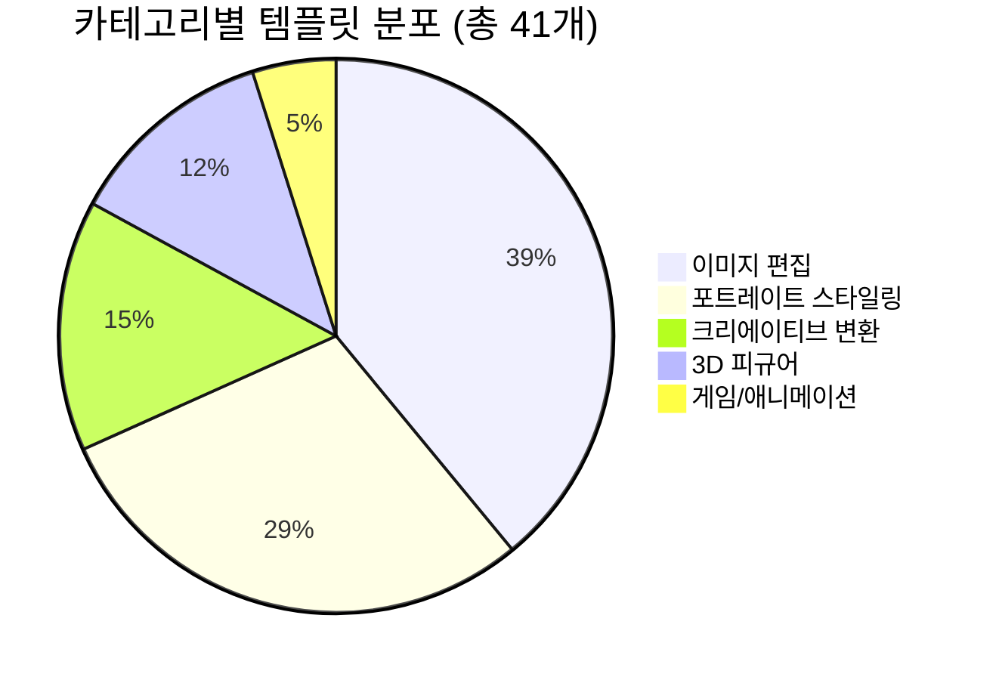
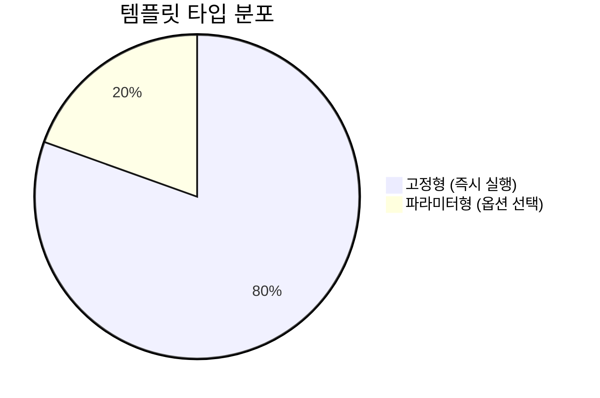
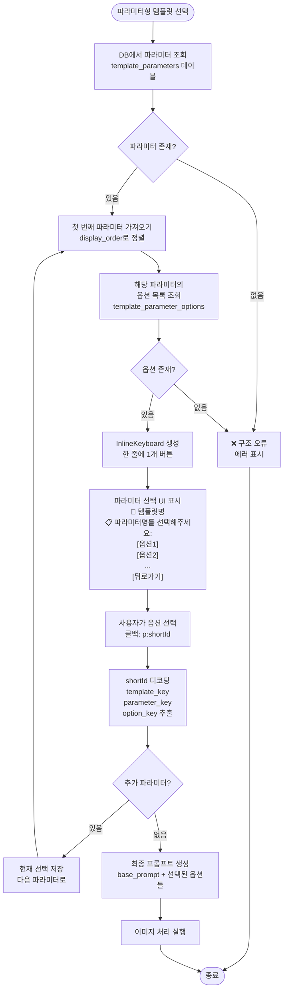
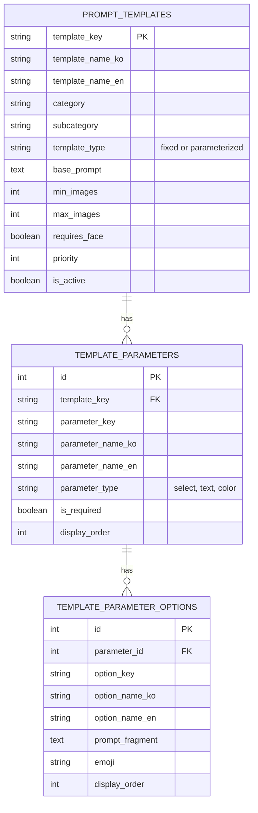
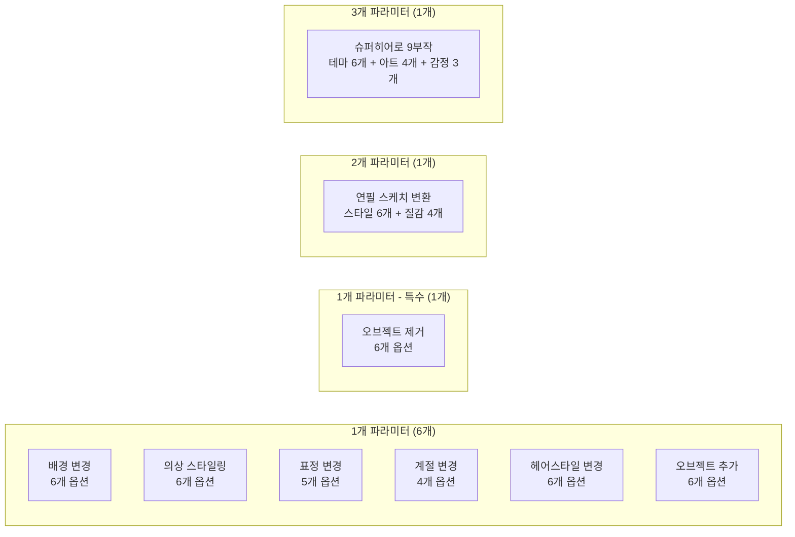
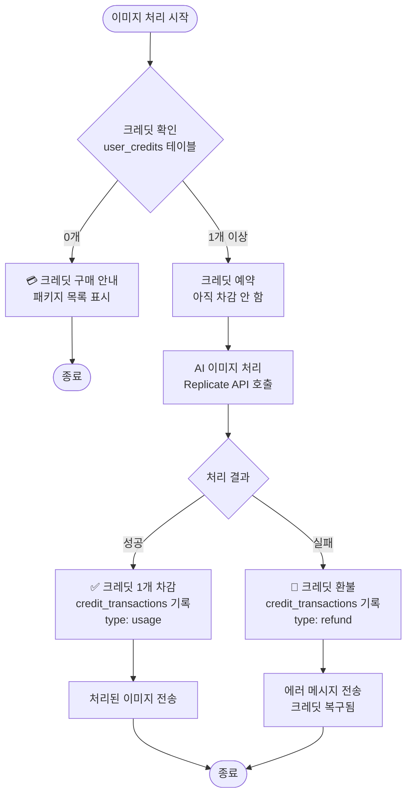
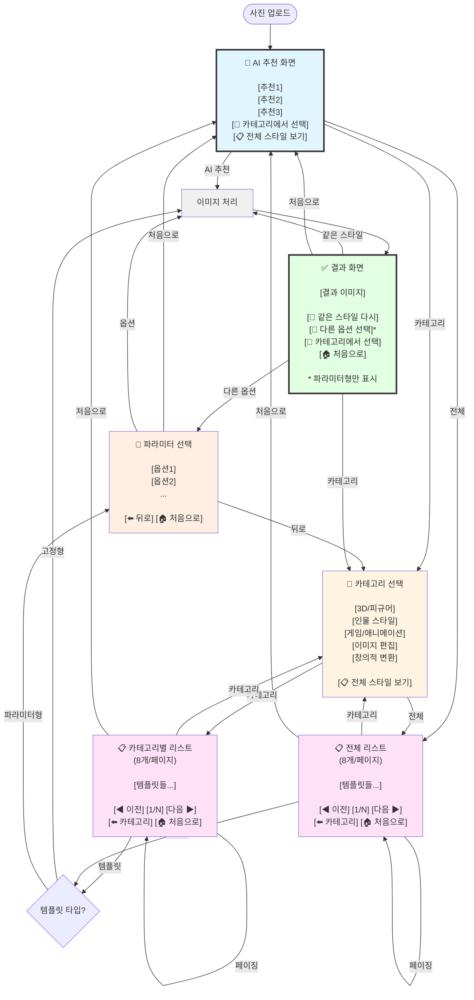

# 프롬프트 템플릿 시스템 흐름도

## 전체 시스템 플로우

## 카테고리별 템플릿 분포

## 파라미터형 vs 고정형

## 파라미터형 템플릿 상세 플로우

## 데이터베이스 구조

## 현재 파라미터형 템플릿 (8개)

## 크레딧 시스템 플로우

## 페이지네이션 플로우

## 버튼 구조 및 네비게이션 플로우 ⭐ (2025-01-10 개선)

> **주요 개선사항**: 일관된 네비게이션, 명확한 버튼 텍스트, 순환 구조

### 🔑 네비게이션 원칙

1. **🏠 처음으로**: 어디서든 원본 이미지 + AI 추천으로 복귀
2. **⬅️ 뒤로**: 이전 단계로 (카테고리 또는 템플릿 리스트)
3. **📂 카테고리**: 결과 화면에서 빠르게 다른 스타일 탐색
4. **🔄 같은 스타일 다시**: AI 랜덤성으로 다른 결과 생성

## 버튼 레이아웃 규칙

### 1. AI 추천 버튼 (초기 화면)
- **배치**: 1줄 1버튼 (텍스트 길이 무관)
- **개수**: 3개 (AI 분석 기반)
- **하단**: "카테고리로 둘러보기" 버튼 (구분선 포함)

### 2. 카테고리 선택 버튼
- **배치**: 1줄 1버튼 (명확한 구분)
- **개수**: 5개 고정
- **하단**: "전체 스타일 보기" 버튼 (구분선 포함)

### 3. 템플릿 리스트 버튼
- **스마트 레이아웃 알고리즘**:
  - 짧은 텍스트 (≤10자): 3개/행
  - 중간 텍스트 (11-20자): 2개/행
  - 긴 텍스트 (>20자): 1개/행
  - 총 40자 초과 시 자동 줄바꿈
- **페이징**: 8개/페이지

### 4. 페이지네이션 버튼
- **배치**: [← 이전] [페이지 X/N] [다음 →] (1줄)
- **하단**: [🔙 카테고리로] (별도 줄)
- **동작**:
  - 첫 페이지: "이전" 버튼 비활성화
  - 마지막 페이지: "다음" 버튼 비활성화

### 5. 파라미터 선택 버튼
- **배치**: 1줄 1버튼 (명확한 선택)
- **개수**: 파라미터별 4-6개
- **하단**: [🔙 뒤로가기] (이전 화면으로)

### 6. 결과 화면 액션 버튼 ⭐ (2025-01-10 개선)
- **배치**:
  - 첫 줄: [🔄 같은 스타일 다시]
  - 둘째 줄 (파라미터형만): [🎨 다른 옵션 선택]
  - 셋째 줄: [📂 카테고리에서 선택] [🏠 처음으로]
- **변경사항**:
  - ❌ 제거: "다른 스타일 시도" (AI 재추천) → 불필요
  - ❌ 제거: "원본으로 돌아가기" (막다른 길) → "처음으로"로 대체
  - ❌ 제거: "이 스타일 평가" (미구현) → 우선순위 낮음
  - ✅ 추가: "🏠 처음으로" → 원본 이미지 + AI 추천 복귀

### 7. 버튼 텍스트 규칙
- ✅ **이모지 최소화** (2025-01-10 적용)
  - 네비게이션 버튼에만 사용: 🏠 ⬅️ 📂 📋
  - 액션 버튼: 🔄 🎨
  - 카테고리/템플릿 버튼: 이모지 제거
- **명확한 한국어 표현**
  - "뒤로가기" → "⬅️ 뒤로"
  - "카테고리로" → "⬅️ 카테고리" 또는 "📂 카테고리에서 선택"
  - "전체 38개 스타일 보기" → "📋 전체 스타일 보기" (동적 개수)
- **일관된 네비게이션**
  - 모든 화면에서 동일한 버튼 텍스트 사용
  - 예측 가능한 다음 단계

---

## 🔍 구조 검증 체크리스트

### ✅ 정상 작동
- [x] 사진 업로드 및 Gemini AI 분석
- [x] AI 기반 스타일 추천 (3개)
- [x] 카테고리별 템플릿 표시 (5개 카테고리)
- [x] 전체 템플릿 목록 표시 (41개)
- [x] 페이지네이션 (8개/페이지)
- [x] 스마트 버튼 레이아웃 (텍스트 길이 기반)
- [x] 고정형 템플릿 즉시 실행 (33개)
- [x] 파라미터형 템플릿 옵션 표시 (8개)
- [x] 단일 파라미터 선택 (6개 템플릿)
- [x] 멀티 파라미터 단계별 선택 (2개 템플릿)
- [x] back_to_main (카테고리로) 버튼 핸들러
- [x] 크레딧 체크 및 차감
- [x] 이미지 처리 및 결과 표시 (Replicate API)
- [x] 에러 처리 및 크레딧 환불

### 🎯 최근 추가된 기능

#### 2025-01-10 (최신) ⭐ 버튼 네비게이션 UX 대개선
- [x] **결과 화면 버튼 통일**:
  - 고정형/파라미터형/재편집 모두 동일한 버튼 구조
  - [🔄 같은 스타일 다시] - 모든 템플릿에 추가
  - [🎨 다른 옵션 선택] - 파라미터형만 표시
  - [📂 카테고리에서 선택] - 빠른 스타일 탐색
  - [🏠 처음으로] - 원본 + AI 추천으로 복귀
- [x] **핸들러 정리**:
  - ❌ 제거: retry (AI 재추천) - 불필요한 단계
  - ❌ 제거: rate (평가 기능) - 미구현
  - ✅ 추가: back_to_categories - 카테고리 선택
  - ✅ 추가: back_to_start - 원본 이미지 + AI 추천
- [x] **텍스트 일관성**:
  - "전체 38개" → "전체 스타일 보기" (동적 개수)
  - "뒤로가기" → "⬅️ 뒤로"
  - "카테고리로" → "📂 카테고리에서 선택"
- [x] **캡션 간소화**:
  - "다음 액션" 섹션 제거 (버튼만으로 충분)
  - 프롬프트 미리보기 제거 (불필요)

#### 2025-01-10 (이전) 파라미터형 템플릿 추가
- [x] **5개 파라미터형 템플릿 추가**:
  - 계절 변경 (4계절 옵션)
  - 헤어스타일 변경 (6가지 스타일)
  - 오브젝트 추가 (6가지 객체)
  - 오브젝트 제거 (6가지 제거 타입)
  - 텍스트 편집 (텍스트 입력 타입)
- [x] **버튼 UX 개선**:
  - 카테고리/템플릿 버튼에서 이모지 제거
  - 스마트 레이아웃 알고리즘 적용
  - 1줄 1버튼 파라미터 선택
- [x] **back_to_main 핸들러 추가**:
  - "카테고리로" 버튼 오류 수정
  - 카테고리 선택 화면으로 복귀

### ⚠️ 개선 필요
- [ ] text_edit 텍스트 입력 타입 핸들러 (현재 select만 지원)
- [ ] 파라미터 필수/선택 명확한 표시
- [ ] 선택한 옵션 확인 화면
- [ ] 옵션 미리보기 이미지
- [ ] 템플릿 사용 통계 추적
- [ ] 관리자 프롬프트 관리 시스템

### 📊 현재 통계 (2025-01-10)
- **총 템플릿**: 41개
- **고정형**: 33개 (80.5%)
- **파라미터형**: 8개 (19.5%)
- **총 파라미터**: 14개
- **총 옵션**: 73개
- **카테고리**: 5개

---

**마지막 업데이트**: 2025-01-10
**변경 사항**:
- ⭐ 버튼 네비게이션 UX 대개선 (일관성, 명확성, 순환 구조)
- 결과 화면 버튼 통일 (고정형/파라미터형/재편집 동일 구조)
- 새 핸들러 추가: back_to_categories, back_to_start
- 불필요한 핸들러 제거: retry, rate
- 텍스트 일관성: 동적 개수, 명확한 네비게이션
- 캡션 간소화: "다음 액션" 섹션 제거
- 파라미터형 템플릿 6개 → 8개 업데이트
- 버튼 구조 및 네비게이션 플로우 다이어그램 개선
- 버튼 레이아웃 규칙 7가지 문서화
