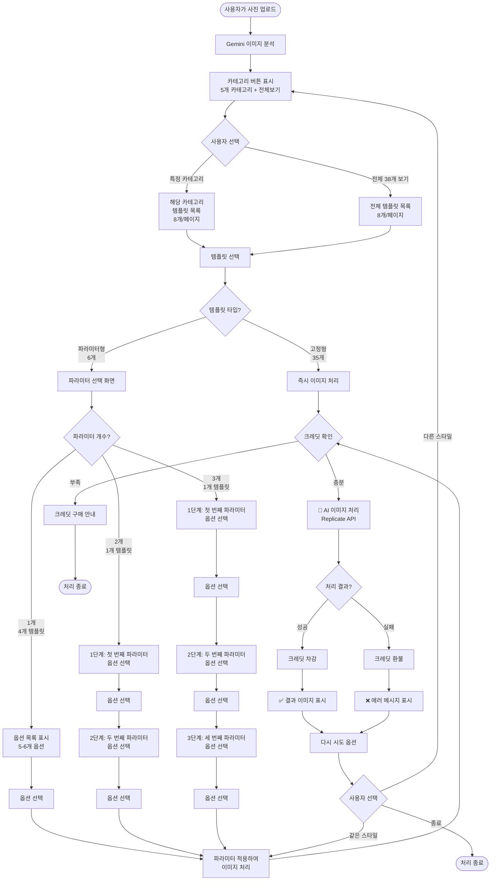
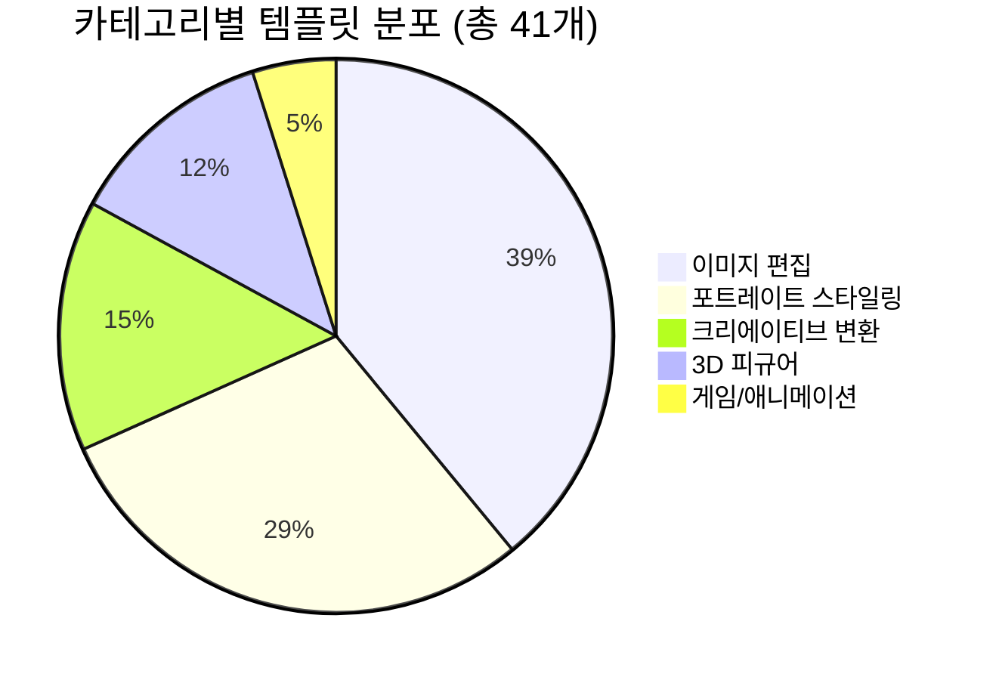
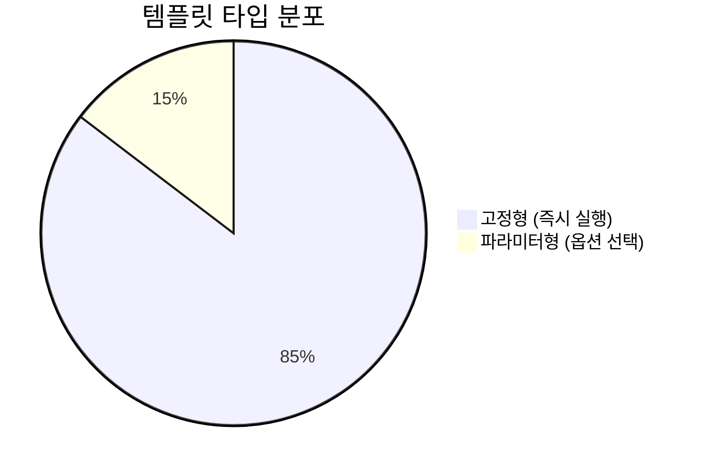
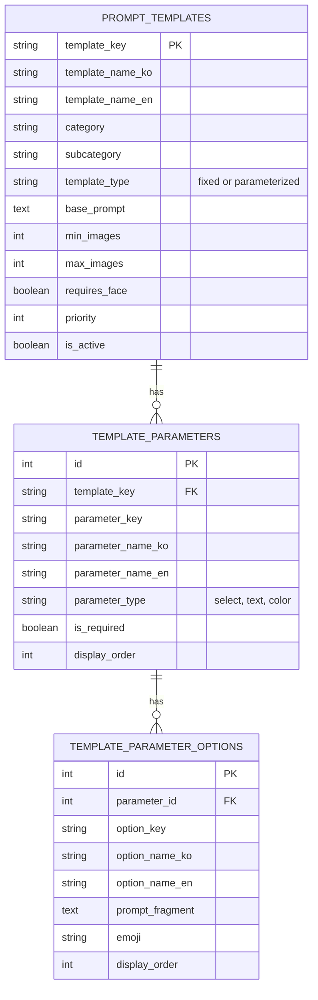
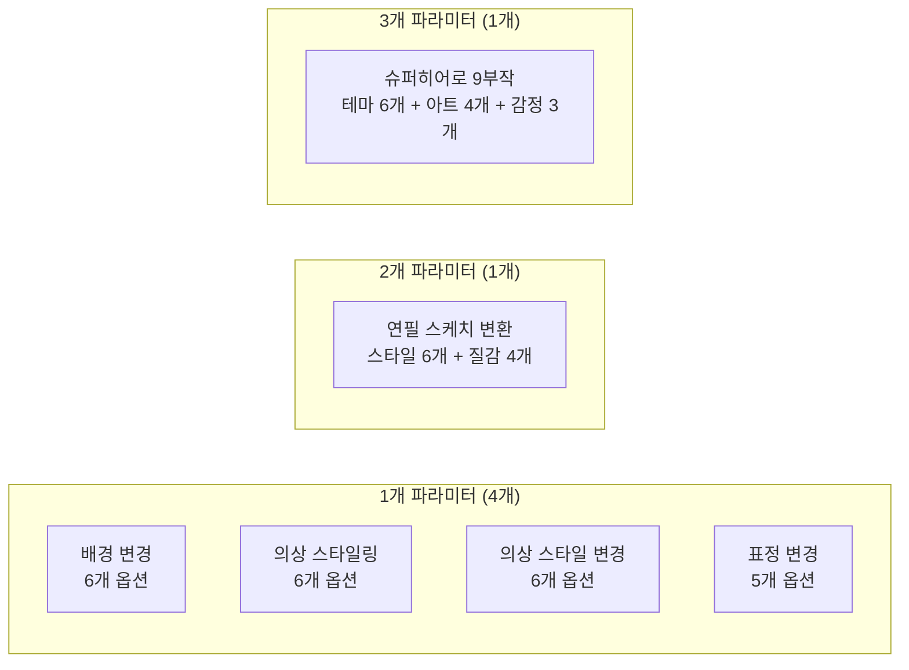
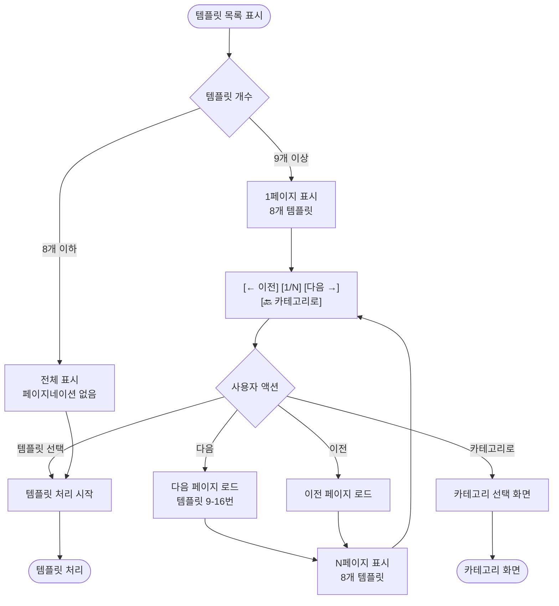

# 프롬프트 템플릿 시스템 흐름도

## 전체 시스템 플로우

## 카테고리별 템플릿 분포

## 파라미터형 vs 고정형

## 파라미터형 템플릿 상세 플로우

## 데이터베이스 구조

## 현재 파라미터형 템플릿 (6개)

## 크레딧 시스템 플로우

## 페이지네이션 플로우

---

## 🔍 구조 검증 체크리스트

### ✅ 정상 작동
- [x] 사진 업로드 및 분석
- [x] 카테고리별 템플릿 표시
- [x] 전체 템플릿 목록 표시
- [x] 페이지네이션 (8개/페이지)
- [x] 고정형 템플릿 즉시 실행
- [x] 파라미터형 템플릿 옵션 표시
- [x] 단일 파라미터 선택
- [x] 크레딧 체크 및 차감
- [x] 이미지 처리 및 결과 표시
- [x] 에러 처리 및 크레딧 환불

### ⚠️ 개선 필요
- [ ] 멀티 파라미터 단계별 선택 (현재는 첫 번째만)
- [ ] 파라미터 필수/선택 명확한 표시
- [ ] 파라미터 선택 취소/뒤로가기
- [ ] 선택한 옵션 확인 화면
- [ ] 옵션 미리보기 이미지

---

**마지막 업데이트**: 2025-10-11
